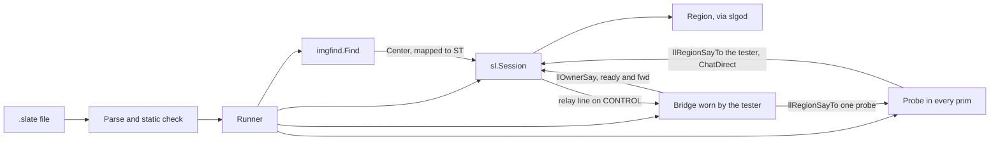
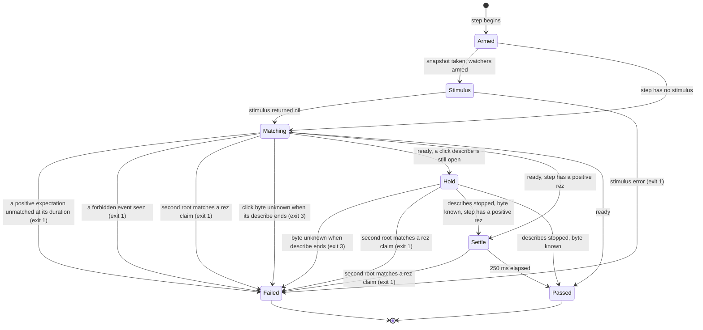
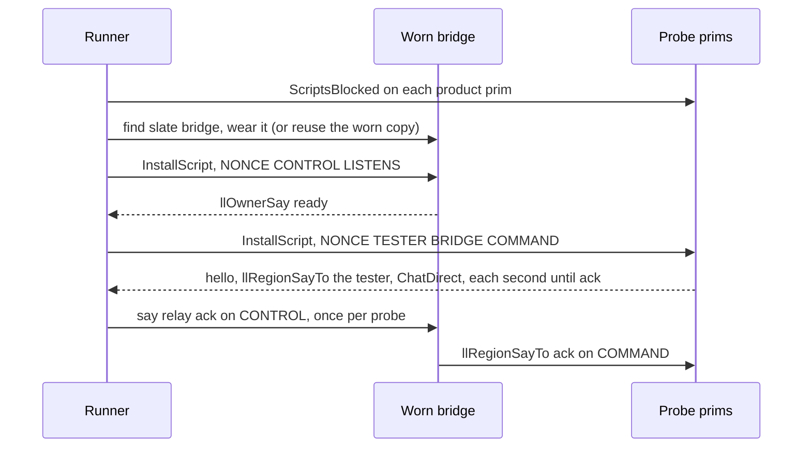

# The Slate runner

Status: built. All of Slate's PRs are in the repository, public since b1c37bc, and the `slate` command has run end to end on the grid ([Fourth round, the runner end to end](#fourth-round-the-runner-end-to-end)). Wave 1 (contextual words, open dialogs, captured values, face properties with `face all`, and `touch ... showing`) is PRs 9 to 13, and wave 2 (button observations and the guarded touch, `ordered` and `sorted` dialogs, items with `wear`, `take off` and `attached`, and the `description` qualifier) is PRs 14 to 19. Both waves have run end to end on the grid ([Sixth round, wave 1 end to end](#sixth-round-wave-1-end-to-end), [Ninth round, wave 2 end to end](#ninth-round-wave-2-end-to-end)). The [PR plan](#pr-plan) says which parts each PR holds. The image finder, `imgfind`, and the picture a face shows, `Session.FacePicture`, are in the repository ([slate-sl-changes.md](slate-sl-changes.md#imgfind), [what a face shows](slate-sl-changes.md#what-a-face-shows)). The runner drives the `sl` API as it stands, plus the two changes in [slate-sl-changes.md](slate-sl-changes.md): the click-action byte ([click action](slate-sl-changes.md#click-action)) and the exported `Session.ScriptsBlocked` ([ScriptsBlocked](slate-sl-changes.md#scriptsblocked)).

This is the document for the engineer who implements the runner. The language itself, which is what a test author reads, is [slate-language.md](slate-language.md): the lexical grammar ([lexical grammar](slate-language.md#lexical-grammar)), the PEG ([syntactic grammar](slate-language.md#syntactic-grammar)), the static checks ([static checks](slate-language.md#static-checks)), tests, sequences and `before each` / `after each` ([tests](slate-language.md#tests-sequences-before-and-after)), the rules a step follows as an author sees them ([steps and timing](slate-language.md#steps-and-timing)), the exit codes, failure block and transcript line shapes ([reading the result](slate-language.md#reading-the-result)), and the worked examples ([worked examples](slate-language.md#worked-examples)). This document does not repeat them. Where the runner must print a sentence exactly, the sentence is here or there, never in both.

Where this document and a runner disagree, the runner is wrong until the document is revised. This document and the language reference must agree; [Step lifecycle](#step-lifecycle) is the precise statement of timing, and every sentence the runner prints is quoted in the language reference.

## Contents

1. [Background and motivation](#background-and-motivation)
2. [Architecture](#architecture)
3. [Tests and the run](#tests-and-the-run)
4. [Step lifecycle](#step-lifecycle)
5. [Event log and arming](#event-log-and-arming)
6. [Timeouts and setup budgets](#timeouts-and-setup-budgets)
7. [Stimuli](#stimuli)
8. [Expectations](#expectations)
9. [Buttons](#buttons)
10. [Linksets and region positions](#linksets-and-region-positions)
11. [Tester position](#tester-position)
12. [Probe and bridge](#probe-and-bridge)
13. [Cleanup and what a failure leaves behind](#cleanup-and-what-a-failure-leaves-behind)
14. [Package and command](#package-and-command)
15. [Security and privacy](#security-and-privacy)
16. [Observability](#observability)
17. [Alternatives considered](#alternatives-considered)
18. [Risks](#risks)
19. [Key decisions](#key-decisions)
20. [Measurements](#measurements)
21. [Open questions](#open-questions)
22. [PR plan](#pr-plan)

## Background and motivation

A product test written as a Go test against `sl.Session` can already touch a face, answer a dialog and read a texture. Three things keep that from being the test a person writes.

The interesting assertion is almost never on the prim that was touched. `Session.Touch` sends `ObjectGrab` and `ObjectDeGrab` for one object (`sl/touch.go`). The script under test then talks, retextures something else, rezzes, or opens a dialog. A Go test has to subscribe to each of those itself and decide what "all of them happened" means and how long to wait. That decision is the language.

The session cannot see every effect a product can produce, and the gaps are specific:

- The object store drops the click-action byte, so a test that wants `PRIM_CLICK_ACTION` has nowhere to read it. [slate-sl-changes.md](slate-sl-changes.md#click-action) fixes that.
- `Session.Faces` can keep returning a texture id the script has already replaced. `doc/objects.md` records a script retexturing faces while `Session.Faces` and `slsh texture` went on returning the old ids for several reads seconds apart; `RequestMultipleObjects` brought the new ids back within a second. A runner that reads once and compares fails a product that worked.
- `Session.Dialogs` holds the dialogs offered to this avatar. `sl/dialog.go` is explicit that a dialog cannot be declined, and that the answer goes out as `ScriptDialogReply` on whatever channel the script chose, usually a negative one so that it cannot be typed. The author cares about the button label. The channel is the script's business.
- An object giving an item is instant-message dialog 9, `sl.DialogTaskInventoryOffered`. `sl.InventoryOfferFrom` parses only dialog 4, so a give awaited on `InventoryOffers` alone does not arrive.
- A rez made by a script is not `Session.Rez`. `doc/rez.md` is about finding a prim this session just made with `ObjectAdd`. A product's `llRezObject` shows up as a new root in the object store with no field naming the prim that rezzed it.

Two platform facts shape the rest.

Chat the avatar hears does not carry a channel number. `msg.ChatFromSimulator` has no channel field, and `Line.Channel` is non-zero only on an echo of this avatar's own `ChatFromViewer` (the comment on it in `sl/chat.go`). Non-zero channels are not delivered to a viewer at all, but a script can hear them. The runner therefore wears a bridge object of its own when a test needs one, and the bridge forwards what it hears.

A link message is the same kind of fact. `llMessageLinked` is delivered only to scripts in the prims it addresses. A script in the root does not receive a message addressed only to a child, and nothing outside the linkset receives it at all. The runner installs one probe script into every prim of the linkset, and the probe reports what that prim received.

The third pressure is time. `Session.Sit` with a zero timeout waits `DefaultSitTimeout` (15 s) and then returns an error that says the sit may have taken. `PayObject` is never sent twice (`sl/money.go`). A texture read can be stale for seconds. A runner that waits on the wrong thing, or waits with no deadline, sits the avatar and leaves them there, or pays twice. The runner picks one clock and writes down what it deliberately does not clean up.

## Architecture

The runner holds one `*sl.Session`, obtained the way `examples/greeter` and `cmd/slpic` obtain one: `sl.DialWeak` to an slgod that is already holding the avatar. Steps run one at a time on one goroutine. It resolves each declared name with `Session.ObjectsNamed`, drives the avatar through `Touch`, `Drag`, `Say`, `PayObject`, `Sit`, `Stand`, `Answer` and `AnswerText`, and watches `Chat`, `Dialogs`, `IMs`, `Faces` and the object store.



## Tests and the run

The author-side rules (the grammar, names, scoping and the lines printed) are in [Tests, sequences, before and after](slate-language.md#tests-sequences-before-and-after). This section is what the runner does with them. Timing inside a step stays in [Step lifecycle](#step-lifecycle).

**A file is a list of tests.** A file of plain steps is one test, named after the file's base name without `.slate`, so `-run` selects it by that name.

**Expansion.** `Check` expands each test into one flat list of steps: `before each`'s steps, the test's own, then `after each`'s, with every `do NAME` replaced by the steps of that sequence, recursively (a cycle was refused by the static check). A `do` closes the step before it, and a `then` after it arms from the sequence's last step ([Arm point and start time](#arm-point-and-start-time)). Every expanded step keeps the source lines it has in its own block and, when it came from a sequence, the chain of `do` call sites that inlined it, innermost first, so the failure block can print one `via do NAME at line L` for each ([Reading the result](slate-language.md#reading-the-result)). The static checks of [Static checks](slate-language.md#static-checks) run on the expanded steps.

**Running one test.**

1. The `as` bindings of the previous test are gone. Header bindings, the hello map and the probes are not touched.
2. The runner starts reading every prim and face the test's state expectations name ([Baselines and original](#baselines-and-original)).
3. The steps run in order, numbered from 1 across `before each`, the body and `after each`. `original` is taken when the body's first step begins ([Baselines and original](#baselines-and-original)).
4. A step that fails fails the test. The test's remaining steps are skipped, except that `after each` still runs. A step of `after each` that fails fails the test too, is reported as an `after each` failure of that test, and skips the rest of `after each`.
5. At the end, an unconsumed dialog hold is forgotten with `ForgetDialog` and reported on that test's result ([Dialog hold](#dialog-hold)), and the test's `as` bindings, and any click describe still open for one of them, are dropped.

After a failed test the runner goes on to the next one. It does not stand, answer, retry a payment or delete anything between tests, except what a `rez` step made, which it deletes at the end of that test, and what a `drop` step changed, which it puts back then ([Cleanup](#cleanup-and-what-a-failure-leaves-behind)).

**What stops the whole run.** Only these four do. The test that was running is reported failed, none of its remaining steps run (`after each` included), no later test runs, and cleanup still runs.

| Cause | Exit |
|---|---|
| A setup failure | 3 |
| A click byte still unknown when its 30 s describe ends | 3 |
| An `alphamode`, `normalmap`, `specularmap`, `glossiness` or `environment` expectation in a session that holds no `RenderMaterials` capability | 3 |
| A dropped chat or IM subscription | 1 |

Why: the first three say the environment is wrong, not the product, and the fourth means events were lost, so the next test could not be trusted either. Every other failure fails its step and so its test.

**Once per file.** Setup (dial, then in this order the header bindings, the item headers, the active group of each second avatar a `group` step names, the linksets of the header bindings, the bridge, the probes and the hello map, and the described click bytes of header bindings) happens once before the first test, and cleanup once after the last ([Cleanup](#cleanup-and-what-a-failure-leaves-behind)). Saving the 6 s per prim of the probe install and removal on every test is what several tests per file are for.

**Bindings.** A header binding lasts for the file. A name bound with `as` belongs to the test run that bound it: `before each`'s bindings are visible to the body and to `after each`; a name bound in the body is not visible in `after each`, which the static check enforces.

**Selecting.** `-run REGEX` ([Package and command](#package-and-command)) runs only the tests whose names match, RE2, unanchored. Each selected test still runs `before each` and `after each`. The other tests are not run and do not appear in `Result.Tests`. A pattern that does not compile, or that matches no test, is exit 4 before anything is dialled.

**Exit code.** 3 if setup failed or a click byte stayed unknown, else 1 if any test failed (a dropped subscription included), else 0. Exit 2 (parse or static check) and 4 are as in [Reading the result](slate-language.md#reading-the-result). The lines printed for each test and for the whole run are there too.

## Step lifecycle

This section is the single normative statement of when a step starts, what it waits for, how long, and how it ends. Every other section refers here instead of restating a rule. The author-visible form is in [Steps and timing](slate-language.md#steps-and-timing).

### States

A step is one stimulus (or none) and the expectations that follow it up to the next stimulus or `then`. The expectations of one step are a set: they may arrive in any order, each event satisfies at most one of them, and all must arrive.



Matching includes the describe: a click describe is started during Matching, when a rez binds a name that a later click expectation uses, and runs beside the other expectations.

### Clocks

| State | Step deadline | Stimulus budget | Click describe (30 s) | Settle (250 ms) |
|---|---|---|---|---|
| Armed | Not running. The tester-position read for a `say` happens here, on the run context, and is on no step clock. | Not running. | Not running. | Not running. |
| Stimulus | Not yet counted. The time a blocking stimulus blocked is added to the deadline only if it returns nil. | Runs, as the context deadline of a blocking stimulus (`Drag`, `Sit`, `Stand`, `PayObject`, `Wear`, `TakeOff`). `Touch`, `Say` and `send` return when the message is sent and use none. | Not running. | Not running. |
| Matching | Runs. Each expectation has its own duration, and the step deadline is the longest. A negative window runs to its own duration. | Over. | Runs from the moment a rez binds a name a later click expectation uses. It is its own clock. | Not running. |
| Hold | Nothing is left to expire: every positive expectation has matched and every negative window has elapsed. | Over. | Runs. | Not running. |
| Settle | Nothing is left to expire. | Over. | Stopped, byte known. | Runs. |

A header binding that a click expectation names is described during setup, not during a step. That describe has the same 30 s and the same failure, and it is on the setup clock ([Timeouts and setup budgets](#timeouts-and-setup-budgets)).

### Failures and exits

The exit-code table and the failure block are in [Reading the result](slate-language.md#reading-the-result). This table says which state gives which.

| Failure | State | Exit |
|---|---|---|
| Stimulus returned an error, or a runtime rule refused it before sending (not the owner, paying is off, no probe for a link, the tester position is not exact, a button part the finder cannot match) | Stimulus | 1 |
| A positive expectation is unmatched when its own duration has elapsed | Matching | 1 |
| A negative expectation sees the forbidden event | Matching | 1 |
| A negative texture or click expectation has no reading at its deadline | Matching | 1 |
| A second root matches a rez claim | Matching, Hold or Settle | 1 |
| The chat or IM subscription dropped lines during the step (stops the run) | End of step | 1 |
| A click byte is still unknown when its describe ends (stops the run) | Matching or Hold | 3 |
| Parse or static check | Before the run | 2 |
| Dial, lookup, probe install, hello, bridge (stops the run) | Setup, before the first test | 3 |

A failure fails its step and so its test; only the three marked stop the run ([Tests and the run](#tests-and-the-run)). A click-unknown failure is not a failed rez and not an unmatched expectation. It is printed while the rez step is still open, before any later step starts, with the click sentence from [Reading the result](slate-language.md#reading-the-result), and the failure block is not printed.

### Rules

**Start time and deadline.** Each step has a start time and an arm point, defined in [Arm point and start time](#arm-point-and-start-time). Each expectation has a duration: its `within`, or the script default (the `timeout` header, else 10 s). The step deadline is the start time, plus the time a blocking stimulus actually blocked on the way to a nil error, plus the longest expectation duration in the step. A stimulus that returns an error adds nothing: the step has already failed. A positive expectation still unmatched when its own duration has elapsed fails the step at that moment, even if another expectation has time left. A negative expectation fails at the moment the forbidden event is seen.

**Stimulus budget.** One duration, used for a blocking stimulus and for nothing else. If the step has any `within`, the budget is the longest of them. If it has none, the budget is the script default. A step with no expectations still has this budget: it is how long `PayObject`, `Sit`, `Stand`, `Drag`, `Wear`, `RezFromInventory` or `take off` may block before the step fails, and the step passes when the stimulus returns inside it. The budget is never zero, because a zero timeout to the `sl` calls means a longer default that is not on this clock.

**Matching.** An event is eligible for a step if it was observed at or after the step's arm point and no expectation has consumed it ([Consumption](#consumption)). The first step of a test is armed when that test starts ([Arm point and start time](#arm-point-and-start-time)). A state expectation is judged against readings, the baseline included ([Baselines and original](#baselines-and-original)).

**When a step is ready.** A step with only positive expectations is ready as soon as every one has matched. A step with any negative expectation is not ready early: after the positives have matched it waits out every negative window. A step with no expectations is ready when the stimulus returns nil. A step with only negative expectations is ready when its windows have elapsed.

**The ClickKnown describe.** This is the only statement of the rule.

- A click expectation on a header binding is described during setup, and that includes a `link N` prim, because the describe runs after the probe step (setup is objects, linksets, probe, click). A name bound with `as` by a positive rez is not a prim during setup, so it is described when the rez binds it, and only when a later step's click expectation uses that name. A name no click expectation uses is not described.
- The describe is: ask for a full object update with the same `RequestMultipleObjects` cadence a texture read uses, because a full update carries the click byte and a terse update does not, and wait up to 30 s until `Seen.ClickKnown` is set ([click action](slate-sl-changes.md#click-action)).
- The 30 s is the describe's own clock. It is not added to the step deadline, it is not taken out of it, and it is not a blocking stimulus whose time is added back.
- During the describe, the rez step's other expectations keep being matched against the deadline they had. If one of them elapses, the step fails then, exit 1, and every describe the step started stops.
- The rez step does not pass, and the next step does not start, until every describe it started has stopped. A negative window in the rez step is not extended to the 30 s.
- If every expectation has matched and the byte is still unknown, the step stays open in Hold, on the same goroutine, until the byte is known or the 30 s ends. Unknown at the end is exit 3, using the prim's in-world name, before any later step. If two describes are open, the first unknown byte is that failure and the other describe stops.
- A second root matching a claim while the step is held open fails the step as it would at any other time; the object polls continue during the hold.
- The value is not compared in the rez step, and the rez step consumes no change of the byte. The click expectation is in a later step, which reads the current byte from its own arm point. A known byte that is not yet the expected value fails that later step at its own deadline, exit 1; that deadline is what waits for the value to change.

**Rez settle.** A step that contains a positive rez expectation and is otherwise ready waits one more object poll, 250 ms, before passing. The settle starts once every describe has stopped with the byte known. An unknown byte is exit 3 and does not settle. A second root that matches a claim during the settle fails the step. Without the settle, a twin that appears on the next poll after the step was ready would be invisible because the step had already ended. 250 ms is the poll `findOurs` uses (`doc/rez.md`). A rez that bound no name a click expectation uses starts no describe and passes when it is ready, after the settle.

**Passing.** A step passes when it is ready, its describes (if any) have stopped, and its settle (if any) has elapsed. The result is the line `pass step N` ([Reading the result](slate-language.md#reading-the-result)).

**`then` and a following stimulus.** Both close the step. The next step starts only after this one has passed, so a step in Hold delays its successor. What the next step may see is decided by the arm point, not by the start time: [Arm point and start time](#arm-point-and-start-time).

## Event log and arming

The runner keeps one event log for the whole run, across tests. Chat lines, dialogs, instant messages, probe reports, bridge forwards, and object and face readings are all events, and each is stamped with the time it was observed: a chat line or an instant message with the time the session received it, so that one which waited while the runner was busy is not stamped late, and a reading with the time of its poll. Chat is subscribed from the start of the run (`Session.Chat`, depth 256); instant messages through `Session.IMs`; the object and face polls run every 250 ms. The runner does not sleep in a loop of its own where `Session.WaitDialog` or the subscription already waits: a poll uses the session's existing wait or a context deadline.

### Arm point and start time

A step has an arm point and a start time. The arm point decides which events are eligible. The start time is where the step's deadline is measured from.

| Step | Arm point | Start time |
|---|---|---|
| First step of a test | When the test started | The same instant |
| Later step that begins with a stimulus | Just before the stimulus is sent | The same instant |
| `then`, or expectation-only after another step | The latest of: the previous step's arm point, the time its stimulus returned, and the observation time of every event its positive expectations matched | When the previous step passed |

Eligible events are those observed at or after the arm point and not yet consumed. This keeps `then` meaning "after the previous set was satisfied" and stops losing events that arrive while the previous step is still in its negative windows, its settle, or a click describe: those events are after the arm point and before the start time.

`then` can only order events whose order the grid preserves. Reports from two different prims have no guaranteed relative order, so a `then` between a report from one prim and a report from another can fail a product that works when the product replies at once. The author-side advice, and the worked link example, are in [Worked examples](slate-language.md#worked-examples); the unordered form is the one to recommend when the reply is immediate.

A `wait` is the one stimulus that arms again when it returns (`armOnReturn`): its effect is time, so the readings are taken afresh (a forced poll, and for a give the inventory), the log is drained, and the arm point is that instant. The baseline, what `is` counts as already so, `is any as $x` and the events and new roots the step may see are then those of the wait's end, and its start time stays the wait's beginning, so the deadline is the same. Before this, the step armed before the wait and an `is` after it passed on a reading from before the wait (measured 2026-10-05: a colour read as it was at the arm point, while the transcript printed the one after the wait).

Watchers are armed before the stimulus so that a script that answers in the same instant cannot win the race. `WaitDialog` already counts a dialog that arrived before the caller started waiting, for the same reason.

### Consumption

An event can be consumed by at most one expectation, ever. Each event is offered to the step's unmatched expectations in source order and is consumed by the first it satisfies. Two expectations that ask for the same chat line need two chat lines. An event consumed by an earlier step is never offered again, and an unconsumed event from an earlier step is eligible for a later step only if it was observed at or after that step's arm point. Events from an earlier test are never eligible: no arm point is earlier than its test's start.

State readings (texture, offset, repeats, rotation, position, size, turn, click, text, fullbright, glow, colour, alpha, alphamode, normalmap, specularmap, glossiness, environment) are events too, stamped when a poll observes them. Such an expectation is a reading of current state: it passes as soon as a reading matches, including a reading that already matched at the arm point, so it cannot by itself prove the stimulus changed anything. The author-side statement of that is in [Steps and timing](slate-language.md#steps-and-timing); `becomes`, `changes` and `original` are the words that do prove it ([State words](#state-words)).

### Baselines and original

**What is tracked.** From the moment a test starts, the runner reads every prim and face that any state expectation in the test names, every prim a button reading names with its faces ([Button observations](#button-observations)), and where each name an `attached` expectation names is worn ([Attached](#attached)): the expanded steps, `before each` and `after each` included, with the prim of a `link N` and, for a name bound with `as`, from the moment it is bound. The first read is taken as the test starts. The cadence is that of a texture read ([Texture](#texture)). Each reading, changed or not, is an event in the log stamped when it was observed; the transcript prints only a reading that differs from the last one printed.

**Baseline.** The baseline of a state expectation is the latest reading of that face (or click byte) stamped at or before the step's arm point. If none exists there, it is the first reading after the arm point, and the transcript carries the baseline note of [Reading the result](slate-language.md#reading-the-result).

**`original`.** The reading of that face or click byte when the test's own steps begin, which is after `before each` has run, so a reset in `before each` is what `original` means. If no reading exists at that point, `original` is the first reading after it. It is fixed once per test and prim.

### Captures

A capture is a binding and not an event. It is made when an expectation matches, so it belongs to the step that matched and is not offered to any other expectation, has no arm point and is never consumed. The runner keeps a table of the test's captures, a name and a typed value, and the order they were bound in; the table is dropped with the test, so a capture from one test is never visible in the next. Two things happen at the match, in this order:

1. **Groups.** Each `matching` pattern of the expectation that has named groups is run against the text it matched (the say's text, or the raw tail of a forwarded line; the dialog's message and the label of the button each clause was assigned; the item's name as the offer carries it; a rez root's name and description; a link report's text), and each group binds `$name` as text. A group that did not take part in the match fails the step with `$name did not take part in the match` and binds nothing from that match, since an empty value the author did not mean would be worse than a failure.
2. **`as`.** The value the expectation reads, in the type of the place: the line, the message, the item name for `say`, `dialog`, `textbox` and `give`, and the reading that matched for a state expectation (the texture, the pair, the number, the click byte, the colour triple, on or off). With `face all` the value is the tuple of faces, which only a `face all` of the same kind can use.

Each binding prints the `capture` line of [Reading the result](slate-language.md#reading-the-result), and a failure block lists the table in binding order. A step that fails after one of its expectations matched keeps what that match bound, so the block says what was bound at the failure.

A use is read when the step is made ready, before its stimulus is sent. That is why a use can be checked against a rule, and the step failed, without anything having been said: the checks that are static for a literal (non-empty for a button part, the link-text rule, the length of the control line) run on the value then and fail the step with a sentence that names the capture and quotes its value. A capture is compared as the literal it stands for and nothing more: exactly for `say`, `give` and link text, as `Dialog.Button` folds for a dialog clause and for `choose`, and as the text of a part for a button. It is never compiled and never put in a string. `Check` guarantees that a name is bound earlier and of the right type; a use the table does not hold is an internal-error sentence and not a panic.

### Arming snapshot

Before a step's stimulus, the runner remembers:

- the dialogs already in `Session.Dialogs`, identified by their offer time, object and channel (why: the session's own `ForgetDialog` identifies them that way);
- the object UUIDs in the store, and for each bound prim, and each child prim named with `link N`, the texture-entry bytes and, once the store keeps it, the click byte and whether it is known;
- the transaction ids of the inventory offers already held;
- a snapshot of inventory item ids, taken with `Session.Inventory` only if this step expects a give, because the call is a full AIS fetch. The snapshot is every non-folder item's `agent.Item.ID`, walked with `Walk` and `Contents`. It is a set of ids, not names: `PickNamed` is not used, because it refuses two items of one name rather than telling them apart;
- the time, which is the arm point.

For a step that begins with a stimulus, the snapshot is taken at the arm point. For a `then` step the arm point is earlier than the moment the step begins, so the UUID set and the dialogs are reconstructed from the log, which stamps the first observation of each. The inventory snapshot cannot be reconstructed, because it is a fetch: it is taken when the step begins. A give that completed between the arm point and the start time is therefore already in the snapshot and is not seen as new. The dialog-9 offer that preceded it is in the log and is still eligible.

### Dialog hold

A dialog matched by `expect dialog` or `expect textbox` is held for that binding, whichever prim of its linkset offered it, and for whom it came to: the tester, or the second avatar named by `to` ([Second avatars](#second-avatars)). The hold lasts until a `choose` or `answer` on that binding, as the same avatar, consumes it, or a later matched dialog for the same binding and avatar replaces it, or its test ends. It is not dropped at the end of the step that matched it: `choose` and `answer` are stimuli, a stimulus always begins a new step, and a hold dropped at the step's end would leave nothing for them to answer. A dialog that was held from an earlier step is not eligible for a new `expect dialog`, because it was observed before that step's arm point.

At the end of each test an unconsumed hold is reported on the `dialog left unanswered:` line of that test's failure block (when it failed) and dropped with `ForgetDialog`, so the next test starts with no hold. There is no decline to send: `sl/dialog.go` records why, and the object's own listen is left to expire. The author never writes the dialog's channel. `Answer` sends `ScriptDialogReply` on `Dialog.Channel`, which is not a `ChatFromSimulator` line and is not an expectation.

## Timeouts and setup budgets

The script default, the floor and the cap are static checks ([Static checks](slate-language.md#static-checks)). The reasons are these. 10 s is long enough for the delays this module has recorded and short enough that a missing line fails while a person is watching. An object sit is answered in about a tenth of a second (`sl/sit.go`). A texture that `Faces` still has cached stale was observed to come back within a second of `RequestMultipleObjects`, after several seconds of stale reads (`doc/objects.md`); the runner re-requests on a one-second cadence ([Texture](#texture)), so 10 s covers about three requests plus the stale interval. A rez made by this session is found within 15 s, but a rez made by a product script is polled every 250 ms for the step's own duration, and a product that rezzes slowly writes `within 20s`. The floor of 100 ms exists so a deadline cannot expire between the send and the first read. The cap of 120 s exists so that a typo of `1m` repeated cannot become an hour.

`within` replaces the default for that expectation only. It does not change the script default.

Setup is not on the step clock. These are its budgets, and each failure names its budget:

| Call | Budget | Why this figure |
|---|---|---|
| `ObjectsNamed`, per header binding | 30 s | A zero timeout would be the 90 s of `AllObjects`. |
| `Properties`, when a header has a description or a step needs an owner | 15 s | The zero default inside that call, written out so the failure can name it. |
| `Session.Wear` of `slate bridge` | 40 s | The default inside that call, written out so the failure can name it. |
| Bridge `ready` line, and each wait for probe hellos | 30 s | The bridge's listens and the probes' first hello. |
| `-make-bridge`: `SetName` | 20 s | The length of its loop in `sl/object.go`, which already returns when the context ends. |
| `-make-bridge`: `Session.Rez` | 15 s | What this session's own rez search allows. |
| `-make-bridge`: `Take` | 20 s | Chosen here; the take is read back with the session's own wait. |
| Click describe, per binding | 30 s | [The ClickKnown describe](#rules). |

**Items and descriptions.** Setup resolves them in the order objects, items, linksets, probes, clicks.

- **Description.** A header with a `description` takes the `ObjectsNamed` result for its name, asks `Session.Properties` for each match with the 15 s budget, and keeps the matches whose description equals the string, or matches the pattern, by `textMatcher`. Exactly one must remain. The failures are `"<name>" with description "<d>" matches none of <n> objects of that name`, and `"<name>" with description "<d>" matches <k> objects (<ids>)`, each exit 3, and a `Properties` error is `properties of "<name>" (15s): <error>`. A prim already claimed by an earlier header with a description fails the later header, `"<name>" with description "<d>" is the same object as <header> (<id>): one object cannot be bound twice`. A header without a description is unchanged: the name must find one prim. The description is read once, and the binding is the prim's id from then on.
- **Item.** An item header is `Session.Folder(ctx, folder)`, a top-level folder of the inventory by name, then `Session.FindItem(ctx, folder, name)`, the item of that name in it. Both pick exactly one by `PickNamed`'s rule, case-sensitive and exact, so a missing, a misspelt or a duplicate name is refused. A failure is `slate: setup: item "<name>" in "<folder>": <the error>`, exit 3. Neither call is given a setup budget of its own, and a folder looked up for one header is not looked up again for the next. The items are kept by header name for `wear`.

`Session.Faces` calls `ObjectByID` with a hard-coded 30 s. A step passes that call a context whose deadline is the time remaining, and `await` returns `ctx.Err()` when the deadline fires, so the 30 s never outlives the step. The same rule applies to every call in a step that can block: its context is the time remaining until the step deadline, never a call's own default.

## Stimuli

Each stimulus is implemented on `sl` as below. The author-side description is in [Steps and timing](slate-language.md#steps-and-timing). A stimulus that returns an error fails the step at once with that error; the expectations do not run.

**Touch anywhere.** `Session.Touch` with the zero `sl.Touch`. The zero value is face 0, with ST `(0.5, 0.5)` filled in because neither coordinate was given. It is not a random point, and it is not whatever prim the camera would have hit. The simulator does not check that the point is on the mesh. The bound prim is the one `ObjectsNamed` returned.

**Touch a link.** Requires the probe map ([Probe and bridge](#probe-and-bridge)). N is `llGetLinkNumber()` of one prim, as that prim's probe reported it at hello. The runner touches that prim's object, with the zero touch unless a refine follows. An unlinked prim reports link 0. Link 1 is the root of a linkset of two or more, not the link number of an unlinked prim. A link the map does not contain fails the step before a touch is sent.

**Touch a face.** `sl.Touch{Face: N}` on the bound prim (or the link's prim). With `at S T`, ST is `(S, T)` and UV is left zero, and the session computes UV from the face when ST is not the zero vector. On a face with no texture entry, a planar face or an animated one, the session copies ST into UV instead (`sl/touch.go`). Why `at 0 0` is rejected statically: the session treats both ST and UV zero as "neither given" and substitutes the middle of the face, and a zero ST with a non-zero UV is the UV path, not a way to send the origin. A button click never hits this, because `(Center.X + 0.5) / pngWidth` is never zero.

**Touch showing.** `touch OBJ showing T`, where T is a UUID or a uuid capture, touches the face that shows a texture. It is done in the stimulus's prepare step, before anything is sent:

1. For every member of the binding's linkset the runner sends `RequestMultipleObjects` and waits one settle. The store can hold an old texture entry for seconds after a script changes a face ([Texture](#texture)), and the search must not be made on it.
2. It reads the region's objects again, recomputes the linkset from those, and decodes the faces of every member that has a texture entry (the count is the prim's face count from its shape; for a sculpt or a mesh, the highest face the entry mentions).
3. Exactly one (prim, face) must have `Face.Texture` equal to T. Zero, or several, fail the step with the sentences of [Reading the result](slate-language.md#reading-the-result), listing every prim and face, and nothing is sent.

The touch is `Session.Touch` on that prim's `*Object` with `sl.Touch{Face: N}` and, for `at S T`, the same ST as a face touch. The probe is not involved, because the prim is found by its id and a link number is never needed. The search covers exactly the faces each member has, counted from its shape ([Face all](#face-all)). Only for a sculpt or a mesh does it decode the faces the entry names, so that a search for the default texture can find several faces or none.

**Touch a button.** [Buttons](#buttons). The touch is sent once, after exactly one match is chosen. It is a click, not a drag: `Touch` sends a grab and an immediate degrab.

**Guarded touch.** `touch ... button ... if shown` runs the same search in the stimulus's prepare step, with the same refusals, and then looks at how many tuples the faces gave. Zero: the stimulus is not sent, the step passes, and the runner prints `slate: step N: no <parts as written> button on "<name>"; the touch was not sent`, with the parts written as the file has them on one line. One: the touch is the one an unguarded touch sends. Two or more: the step fails with the sentence and the list of centres of an unguarded touch with no `nth`, and the pictures are kept. `button N` is refused with `if shown` by static check. A face that returns `sl.ErrNoTexture` adds no tuple, so a prim with no textured face is zero tuples here, and the unguarded touch says `no face ... has a texture`. A refusal of the search (a planar or animated face, `image` or `oval`, a finder or session error) fails the step as it fails a touch: it is not zero. The guard is legal only in `before each` and `after each`, a guarded step has no expectations, and the step after it has a positive one, all by static check ([Static checks](slate-language.md#static-checks)). Why: a guard that may skip its touch makes a test two paths, and a guard whose convergence step were optional would skip a misspelt label silently on every run.

**Drag.** `Session.Drag` with two points, both on face N, ST set, UV zero. `Press` and `Dwell` are 0. `Move` is the `over` duration, or 500 ms. `Rate` is 0, so `Drag` uses `TouchRate` (45 updates a second). The call's context deadline is the stimulus budget. `Drag` always sends the release, including when the context is cancelled, and the release uses a 10 s context that ignores cancellation (`sl/touch.go`). Expectations do not start until `Drag` returns. An optional `link N` selects the prim as for a touch. One segment is the whole path.

**Say.** `Session.Say(ctx, text, channel)`. A negative channel goes out as a `ScriptDialogReply` with this avatar's id as the object, at most `sl.MaxDialogReply` (254) bytes. A non-negative channel, including 0, is `ChatFromViewer` of type `ChatSay`. `SayAs` refuses whisper and shout on a negative channel, and Slate offers neither on any channel. Anyone nearby can type a positive channel as `/1 menu`; a negative channel cannot be typed that way. `Session.Say` does not enforce the 1023-byte limit on a non-negative channel; the static check does, so the line is not cut by the chat field. The runner does not warn on channel 0.

The speaker is resolved before anything is said:

- `as tester`, or no `as`: speak as this session.
- `as owner of OBJ`: legal only when the tester's id equals `OBJ`'s owner. The owner is `sl.Seen.Owner`; a zero owner is resolved with `Properties` (15 s) before the comparison, and if it is still zero the step fails with `the owner of OBJ is not known` rather than match nobody in particular. If the tester is not the owner the step fails before anything is said. A group-deeded object, whose owner id is the group, fails for this runner.
- `as NAME`, for an `avatar NAME` header: `Session.Say` of that second avatar's session ([Second avatars](#second-avatars)). It is written without `avatar`.
- `as avatar "Name"`: the name is compared to the tester's displayed name with `strings.EqualFold` of the whole string. If it is not the tester the step fails with `this runner drives only the tester` and does not speak. `Session.Find` is not used: it ignores case and also matches a prefix and either half of a display name, so it would accept `"Example"` as `"Example Resident"`.

Before a `say` is sent, the runner measures the distance from the tester position ([Tester position](#tester-position)) to every binding named in that step (the `as owner of` binding, if any, and every binding an expectation in the step names), using the region position of [Linksets and region positions](#linksets-and-region-positions). The tester is not put through that walk. If any binding is more than 20 m away, the step fails before the say, exit 1, with the 20 m sentence in [Reading the result](slate-language.md#reading-the-result).

The say radius is measured: 20 m, heard at 19.5 m and not at 20.5 m, for the tester's say on either kind of channel and for a script's `llSay` ([Measurements](#measurements)). The earlier figures, a negative-channel say heard at 2 m and not 100 m up, are recorded in a comment in `sl/chat.go`. A binding not named in the step is not checked, so a far sign that a later step only looks at does not block a nearby menu. `on owner` on an expectation is `llOwnerSay` and is not this check: the session already received it. `send` is not this check either: the worn bridge hears the tester wherever the tester is, and relays across the region.

**Pay.** `Session.PayObject`. The amount is an integer number of Linden dollars, at least 1. An omitted reason passes an empty string, and `PayObject` then sends the object's name, which is what the viewer sends. The call reads the owner first and refuses, before sending, an amount the balance cannot cover (`sl/money.go`). Before the call the runner prints the pay transcript line, which is printed even if the call then fails. On `*PayRefused` or `*PayUnconfirmed` the step fails with `Error()` and the expectations do not run. A success returns the transaction id; the expectations then run, with the deadline extended by the time `PayObject` blocked. A refused or unconfirmed payment is never sent again.

`PayObject` takes no timeout and waits more than once: for the owner lookup, for the balance, for the grid's answer, and, when that answer does not come, for one more balance read, which runs without cancellation if the caller's context has already ended (`sl/money.go`). `SetOptions(MoneyTimeout)` is therefore not a cap on the call; each wait can use a full `MoneyTimeout`. The runner passes a context whose deadline is the stimulus budget, and for the duration of the call sets `MoneyTimeout` to the same budget, then restores the previous options. `await` returns `ctx.Err()` when the deadline fires, so the lookup, the balance and the answer together stop at the budget. The unconfirmed balance read is the exception the code already makes, and the runner does not skip it: that read is how `*PayUnconfirmed` says whether the L$ moved, and it can take one further `MoneyTimeout`. The worst case is about two budgets, not four, and it is still inside the stimulus. A script `timeout 10s` does not also wait the 15 s `DefaultMoneyTimeout`. A step whose longest `within` is 30 s gives the payment 30 s.

Both the `allow pay` header and `Options.Pay` ([Package and command](#package-and-command)) are required; either one alone is a failure before `PayObject` is called, and the double consent is described to authors in [slate-language.md](slate-language.md#steps-and-timing).

**Sit.** `Session.Sit` with the stimulus budget; never zero, because zero is `DefaultSitTimeout` (15 s), which is not this clock. Success is the seat it returns: the avatar was reparented onto the object, which is the simulator's own word that the sit took, and the avatar may have moved. `ErrSitRefused` fails with the simulator's text. `ErrTimeout` fails with `Sit`'s own text, which already says the sit may have taken; the runner does not treat a timeout as a refusal. Sit is one wait and does not stack.

**Stand.** `Session.Stand` with the stimulus budget, never zero. Success is a nil error. An avatar this session believes is already standing is not an error, which is `Stand`'s own rule, and the flag is still sent. Stand is one wait.

**Choose.** Every form presses a button of the dialog held for `OBJ` ([Dialog hold](#dialog-hold)) with `Session.AnswerIndex`, which sends the position of the button, so a dialog with two buttons of one label is answered on the one chosen. The forms differ in how the position is found, in prepare, before anything is sent:

- `choose "L"` and `choose $x`: the buttons whose label equals the string or the capture by `Dialog.Button`, which trims and ignores case. More than one fails the step and lists them, rather than pressing the first. None fails it too.
- `choose matching "RE"`: the buttons whose trimmed label matches, unanchored. Exactly one is pressed; zero or several fail the step and list the buttons.
- `choose button N`: position N from 1, in the order of `Dialog.Buttons`. A number past the last fails the step.

If no dialog is held for that object, the step fails before sending. If the held dialog `IsTextBox`, the step fails and says to use `answer`. On success the hold is cleared and `AnswerIndex` forgets the dialog.

**Answer.** `Session.AnswerText` on the held dialog. If it is not a text box the step fails and lists the buttons. `sl.TextBoxToken` (`!!llTextBox!!`) is how the session recognises a text box; it is not written by the author and not printed as a button. Downstream the product cannot tell `AnswerText` from `Answer`, which `AnswerText`'s comment already says; the runner can, because it branches on `IsTextBox`.

**Send.** [Probe and bridge](#probe-and-bridge). The tester speaks a `relay` line on CONTROL, the worn bridge relays the command to the one prim whose link is the sender, and that probe calls `llMessageLinked`. It returns when the line is spoken. A `send` to a link number absent from the map fails before the command is spoken. A `bad` report from the prim that should have sent fails the step with `the probe rejected the command`.

**Wear.** `wear ITEM on "POINT" as NAME` is `Session.Wear(ctx, item, point|sl.AttachAdd, budget)`, where `item` is the `*sl.Item` the item header found at setup ([Timeouts and setup budgets](#timeouts-and-setup-budgets)), `point` is `sl.AttachPointNamed` of the string, and `sl.AttachAdd` asks for the item to be added and not to replace what is on the point. It is a blocking stimulus, with the stimulus budget, and its time is added to the step deadline when it returns nil.

1. In prepare, before anything is sent, `Session.WornFromItem` is asked. An item that is already worn fails the step with `slate: step N: "<item>" is already worn on <point>; take it off first`, and the name is not bound.
2. `NAME` is bound when the step is made, to an empty prim, so that the step's expectations, which are made before the stimulus is sent, can name it. A say or a dialog from it is matched against what the binding holds when the line arrives. The step arms before the request, as every step that begins with a stimulus does, so the product's first words are eligible.
3. When `Wear` returns, the runner reads the region's objects and binds `NAME` to the worn root and its linkset (the root and its children), and takes one object poll at once, so that an `attached` expectation has a reading.

`Wear` returns after about 0.2 s, and the product's own `on_rez` and `attach()` reach it about 2 s after `Wear` returns ([Eighth round](#eighth-round)). The step's `within` has to cover that gap, which the default 10 s does. The one exception to the rule that a name bound in a step is usable from the next step is this name, and the References static check is extended for it. The runner does not take off what a test wore: that is `after each`'s job. A run that was killed can leave the product worn, and the next `wear` then fails with the sentence of step 1.

**Rez.** `rez ITEM at|by X Y Z as NAME` is `Session.RezFromInventory(ctx, item, pos, group, budget)`, with `item` the item header's, `group` from `Session.ActiveGroup` and `pos` the region position, or the tester's exact position (`testerPos`, on no step clock) plus the offset. It is a blocking stimulus with the stimulus budget. Like `wear`, `NAME` is bound when the step is made and filled when the call returns (the root and its linkset from the region's objects, then one object poll), so the step's expectations can use it. The object is recorded on the test the moment `RezFromInventory` hands it back, even beside an error, and `testRun.finish` deletes each with `Session.Delete` to `Session.TrashFolder` on a context the test's cancel does not reach, after `after each` and the failure blocks and before the pass line (`slate/rezitem.go`). A delete that fails is printed and fails the test. `RezFromInventory` ends at once on an alert of the shape `Can't rez object ... because ...` heard after the request, as `Session.await` and `findOurs` read `alerts` since a mark; the step then fails with the alert quoted and nothing to delete. A step starting with `rez` is this; the parser reads the expectation `rez` only after `expect`. Measurements are in [Stimuli](slate-language.md#stimuli).

**Take off.** `take off NAME` is `Session.TakeOff` with the item `NAME` was worn from: the one `wear` recorded, or, for a header object that is worn, the item its `Seen.AttachItem` names. A binding with no item fails the step with `NAME is not worn`. The stimulus is complete when the store no longer lists the worn root: it reads the object by id on the object poll (250 ms) under the stimulus budget, and past the budget fails with `"<item>" is still in the store <budget> after the take off`. The store dropped the root about 0.1 s after the request ([Eighth round](#eighth-round)), and `attach(NULL_KEY)` arrived about 75 ms after the request, before that, so waiting on the store is enough. When it returns it takes one more object poll, so that an `attached NAME off` in the same step has its reading. A name that was taken off is not usable from the next step on, by static check.

**Drop.** `drop ITEM into OBJ [link N]` and `drop ITEM onto OBJ [link N] face N` are the tester's, and blocking under the stimulus budget (`slate/drop.go`). The prim is the binding's, or the link's, found in prepare as a touch finds it. `ITEM` is the `*sl.Item` the item header found at setup.

- **into.** In prepare an item whose owner mask lacks `sl.PermCopy` is refused with a sentence of its own, before anything is sent: the viewer moves such an item out of inventory and the run could not give it back. In send, `putIn` reads the contents with `Session.TaskInventory` (a `RequestTaskInventory`, answered by a filename, and the file over the xfer protocol), sends `Session.PutInObject` (one `UpdateTaskInventory`, key 0, or for a script one `RezScript` with `Enabled` set), and reads again, every object poll, until the copy shows: an entry whose id was not there, of the item's asset type (`sl.AssetType.String`, the word the contents file uses), of its asset where the entry shows one, and named as the item or as the item, a space and a number (`ourCopy`). The entry is kept on the test for its end. A copy that does not show within the stimulus budget fails the step, and the test keeps the drop and the ids the contents held before it, so that the end of the test reads the contents once more and removes a copy that came late.
- **onto.** In prepare an item whose asset type is not a texture is refused with a sentence of its own. In send the runner reads the face's texture (`Session.Faces`; a face the prim does not have fails the step) and the contents, then follows the viewer's `handleDropMaterialProtections` in its order: an entry of that asset in the contents, and nothing goes in; otherwise no copy permission, and the step fails; otherwise no transfer permission, and `putIn` puts a copy in; otherwise nothing goes in. The permissions are the owner mask of the item as the tester's inventory has it. The face is then set with `Session.SetFace`, which changes the texture id of that face and keeps the rest (`ObjectImage` with every face of the prim). The test keeps the object, the face, the texture it had and the texture it was given, and the copy if one went in.
- **Both** take one object poll when done, so that a texture expectation in the step has its reading.

**Group.** `group NAME "Group Name"` and `group NAME none` are `Session.ActivateGroup` on the second avatar's session, blocking under the stimulus budget (`slate/group.go`). The group is looked for in the `Groups` of that session's `Where`, by `strings.EqualFold` on the name, as slsh's `group` does (`chooseGroup`); none, an unknown name and two of one name fail the step with a sentence that names the binding only. An active group that is already the asked one sends nothing. Otherwise the step marks the avatar as changed and sends; `ActivateGroup` returns when `ActiveGroup` is the group, which is the confirmation slsh's `group` relies on, and a timeout fails the step. The restore is under [Cleanup](#cleanup-and-what-a-failure-leaves-behind).

### A drag on the screen

`drag OBJ on screen from POINT (to X Y | by DX DY) [over D] [settle]` ([the language](slate-language.md#stimuli)) is `Session.DragOnScreen` with the binding's root and a `sl.ScreenDrag` of two points. It is a blocking stimulus, with the stimulus budget as `drag` has: `Move` is `D`, 500 ms if omitted, and `Press`, `Dwell` and `Rate` are left at `sl`'s, as the face drag leaves them. `DragOnScreen` always lets go, cancellation included, and the runner does nothing to undo that.

1. In prepare, before anything is sent: the root of the binding's linkset must have an attachment point that is a HUD point (`sl.IsHUDPoint`, 31 to 38), else the step fails with `slate: step N: "<name>" is not worn; a drag on the screen needs an object worn on a HUD point, and nothing was sent` (`is worn on <point>` for another point). The checker has already refused a binding it knows is not on one ([Static checks](slate-language.md#static-checks)); a header binding is known only here, from the store.
2. A start given as a face is turned into pixels with `HUDView.PointOf` over the linkset as `Session.Linkset` reads it now (link N, or the root), so a HUD that moved since the last step is found where it is. A face the prim does not have, or a shape that cannot be placed (`sl.ErrShapeNotPlaced`: only a plain box or cylinder can), fails the step with a sentence and nothing sent. A start in pixels is used as written.
3. `by DX DY` is added to the start in pixels; `to X Y` is used as written.
4. `settle` is `ScreenDrag.Settle`. It waits for the region to say the prim pressed has changed, for `Options.HUDChangeTimeout` at most, 5 s by default, and a HUD that does not change fails the step with `<prim> to change when pressed` and a timeout, after letting go. The static check adds that wait to the drag's time against the step's budget, because the stimulus is bounded by the budget as a whole. The check uses the default, as the runner sets no other.
5. A start or an end off the world view fails the step in prepare, with `slate: step N: the drag would start at X,Y, off the WxH view; nothing was sent` (`end` for the end); `DragOnScreen` refuses any point off it as well (`sl.ErrOffView`).
6. After the release `DragOnScreen` waits, whether or not the step settles, until the prim pressed has kept one size for a second (at once if it is at its press size), `Options.HUDChangeTimeout` at most, failing with a timeout that says the HUD was still changing if it still is. The static check does not add that wait to the budget, which holds it all the same ([A drag](hud-screen.md#a-drag)).

The world view is virtual, and given by the run, not the file: `Options.Screen`, an `sl.HUDView` whose zero width or height is 1920 by 1025 (`DefaultScreenWidth`, `DefaultScreenHeight`: a 1920x1080 window less the viewer's menu bar) and whose zero zoom is 1. `slate` sets it from `--screen WxH` and `--hud-zoom Z`. The reason pixels are the unit and not fractions: where a HUD sits on the screen depends on the shape of the world view ([The world view](hud-screen.md#the-world-view)), so a fraction would not free a test from the screen, and pixels in a stated screen are honest and match screenshots and the measurements; the face form is for a test that wants no pixels. What the run is told is not measured against the viewer's real window, which is the tester's to state.

Not built: the effect of a drag on a worn HUD, its position and size, is not an expectation. There is no observation of a worn root's attachment offset or scale in Slate today.

## Expectations

An expectation is matched against the eligible events of the step ([Event log and arming](#event-log-and-arming)). The failure block and its line shapes are in [Reading the result](slate-language.md#reading-the-result).

The object watcher, which reads the region for readings and for new roots, polls only for a test that has a state expectation or a rez. A test with neither makes no object read for it. For a rez the watcher also keeps the root prims first seen after the test began.

### Matching text

Where an expectation compares product text, the author writes a literal or `matching "RE"`: say text, dialog message, text box message, give item name, rez `name` and `description`, and link text. A literal keeps its exact, case-sensitive meaning. A pattern is Go `regexp` syntax, unanchored (`MatchString` on the same string the literal would be compared to), and `(?i)` makes it case-insensitive. It is compiled once, at static check, and kept in the parsed script; one that does not compile is exit 2. A capture ([Captures](#captures)) stands where a literal does, is compared as the literal is, and is never a pattern. `answer` and the text of the stimulus `say` take literals only, and the text of `send` a literal or a capture. Link text in a pattern is not limited to the link-text character set, which only a literal needs because only a literal goes on the wire; the probe still reports only printable ASCII ([Wire format](#wire-format)), so a pattern cannot see a delivery that was an `overflow`.


### Say

A chat line, or a bridge forward of a listened channel, whose text and speaker match. The text, literal or pattern ([Matching text](#matching-text)), is matched against `Line.Text`, already trimmed of its trailing NUL; a literal is exact and is not a substring. A protocol line ([Wire format](#wire-format)) never satisfies `say` and never trips `expect no say`.

The channel decides which lines are candidates:

| Written | Candidates |
|---|---|
| `on public` or `on 0` | `Line.Type` is `ChatWhisper`, `ChatSay` or `ChatShout`. |
| `on owner` | `Line.Type` is `ChatOwner` (`llOwnerSay`, which is not a numbered listen channel and is not heard by `llListen`). |
| `on debug` or `on 2147483647` | `Line.Type` is `ChatDebug`. |
| `on direct` | `Line.Type` is `ChatDirect`. |
| `on N`, any other int32 | A bridge forward of a script listen on N. The product text is the raw tail after the quoted speaker name: not quoted, not unescaped. |
| (not writable) | `Line.Type` is `ChatRegion` (7; `ChatTypeName` returns `"region"`). It matches neither `on public` nor a listen, satisfies no `expect say`, and trips no `expect no say`. It is printed in the transcript as `region`. |

The speaker matches as follows. `tester`: `Line.Source` is this session's agent id, or the forward's speaker key is that id. `owner of OBJ`: the owner's id, read as for `as owner of`. `avatar "Name"`: `strings.EqualFold` of the whole `Line.From`, or of the whole speaker name on a forward; not a prefix and not either half of a display name. `object OBJ`: the speaker key equals the id of any prim of `OBJ`'s linkset ([Linksets and region positions](#linksets-and-region-positions)); with `link N`, the id of the prim that link N maps to in the hello map, so it needs the probe. A link the map does not contain fails the step when it starts, before any stimulus is sent. `anyone`: any speaker except a protocol line.

### Dialog and text box

A `sl.Dialog` observed at or after the arm point whose `Object` is the id of any prim of the binding's linkset, or whose `ObjectName` equals the current name of any prim of that linkset. With `link N` the dialog's `Object` must be the id of that prim, from the hello map, and `ObjectName` is not consulted. A dialog for which `IsTextBox` is true does not match `expect dialog`; it matches `expect textbox`, which is the same match with a message and no button clauses. What follows is applied to one offered dialog, in this order:

1. **Message.** With a `text`, the message equals the literal, matches the pattern or equals the capture ([Matching text](#matching-text)). Without one, any message matches.
2. **Count.** With `count N`, `len(Dialog.Buttons)` is N.
3. **Clauses.** Each `button` clause is made ready as a test of one label: a literal or capture by `fold` (trimmed and case-folded, which is `Dialog.Button`'s rule), a pattern unanchored against the trimmed label. A clause with `N` can take only the button at position N, counting from 1 in the order of `Dialog.Buttons`. The clauses are then given buttons by a maximum bipartite matching (augmenting paths; the matrix is at most 12 by 12): a clause that could take several buttons does not starve a later one, and a greedy pass in source order would fail `matching "a|b"` then `"a"` against buttons `a b`. Two identical literal clauses are two clauses, each needing a button, so one matching button satisfies only one of them.
4. **`only`.** Every button is given to some clause.
5. **`ordered`.** The assignment of step 3 is in order: a clause written after another has a button after it in `Dialog.Buttons`. If the assignment the matching found is not, the runner searches for another assignment of a distinct button to each clause that is, by a walk of the clauses in order with the last button used (at most 12 by 12, and a dead end is remembered, so the walk is small), and uses it, so the captures of the clause patterns are bound from that one. When there is none the reason is `ordered: "<label>" comes before "<label>"`, naming the first pair of clauses of the matching's assignment that are the wrong way round.
6. **`sorted`.** The labels of the whole dialog, trimmed, or with `matching` those the pattern matches, are in non-decreasing order. The compared text of a label is the pattern's one capturing group when there is one and the label otherwise. When every compared text matches `^-?[0-9]+(\.[0-9]+)?$` the comparison is of the numbers, and otherwise of the texts lower-cased, so `n9` is before `n10` as numbers and after it as text. The reason is `sorted: "<label>" comes before "<label>"`, naming the first label that sorts before the one listed ahead of it. A named group of a sort pattern binds nothing.

When any step fails, the dialog does not match, and the reason is kept for the `unmatched` line: `count N but the dialog has M buttons`, `clauses could not all be assigned: <clause> has no button` (no button satisfies the clause alone) or `... has no button of its own` (it fits only buttons other clauses need), `only: "<label>" is not claimed by a clause`, and the `ordered` and `sorted` reasons, joined by `; ` when both fail. The reason is that of the last dialog that met the object and the message; with none, there is none. The sentences are in [Reading the result](slate-language.md#reading-the-result).

**Order.** `Dialog.Buttons` is the order of the button blocks of the `ScriptDialog` message (`sl/dialog.go`), which is the order of the list the script passed to `llDialog`. A 12-button dialog was measured arriving in exactly that order ([Fifth round](#fifth-round)). It is not the order a person sees, which the viewer lays out from the bottom row upward, three to a row (published LSL behaviour, not measured here). `button N` and `choose button N` use the list order.

The match is held ([Dialog hold](#dialog-hold)), and binds what [Captures](#captures) says: the message, the named groups of the message pattern, and the named groups of each clause pattern, bound to the label of the button that clause was given.

Dialogs are delivered to the avatar they were offered to, and `Session.Dialogs` is that session's. A dialog the product offers to someone else is invisible, the expectation times out, and the transcript says no dialog was offered to the tester. The exception is a second avatar the run was given: its session's dialogs are logged with its binding, and `to NAME` on the expectation selects them, so the tester's `expect dialog` never matches one and the other way round.

### Texture

Face N of the bound prim (or of the prim a `link N` names, from the hello map) has `Face.Texture` equal to the UUID. The words are in [State words](#state-words). The read is not one call to `Faces`.

`Session.Faces` returns the store's texture entry, and after a script changes a face that entry can stay at the old id for several seconds. Measured: `doc/objects.md`, "An appearance on a terse update". The same page records that asking again with `RequestMultipleObjects` brought the new ids within a second. On each 250 ms poll, if the expectation is unmet and at least one second has passed since the last request, the runner sends `RequestMultipleObjects` with `CacheMissType` 0 and then reads the store. `Faces` decodes the entry. (Why not the session's own re-describe: it sends the same request and then waits up to 3 s, which is not a cadence a step can use in a loop.)

The number of faces decoded for a prim is one more than the highest face any expectation of the test names, and for a `face all` it is the prim's face count from its shape, or the most a texture entry can name, 32, when that is not known ([Face all](#face-all)). A face beyond the prim's real faces therefore reads as the default entry, the one a texture entry gives every face it does not list, and not as an error. It is not a face of the prim, and a texture expectation on it compares against that default.

A reading that still equals the arm-time entry does not fail the step early; the step fails only when the expectation's duration elapses. A reading that matches passes immediately. A planar face or a face with a running texture animation is not a texture-id failure, because the id can still be compared. Those two conditions fail a button search on that prim ([Buttons](#buttons)).

### Offset, repeats, rotation

Offset: `Face.OffsetsF()` against the two literals, each within 2/32767. The setter quantises to about one part in 32767 (`sl/textureset.go`), so an exact float compare would fail a face that had taken the value the author wrote.

Repeats: `Face.ScaleS` and `Face.ScaleT` against the literals as float32, each within 1e-4 absolute. Negative repeats are a flip (documented in [face-pictures.md](face-pictures.md#the-mapping)) and are a legal expectation.

Rotation: the literal is a fraction of a turn, not radians and not degrees. `Face.Rotation` is an `int16`. The compare is a float64 division, not an integer division and not `RotationRad`, which is radians:

```go
turns := float64(face.Rotation) / 32768.0
if math.Abs(turns-want) > 2.0/32768.0 {
    // fail
}
```

`8192` is a quarter turn, which is `0.25`, and `16384` is a half turn ([face-pictures.md](face-pictures.md#the-mapping)). `face.Rotation / 32768` in Go divides two integers and is always 0 or -1, which is wrong.

### Click

The prim's click-action byte equals the named constant. The names and their bytes are in the click table of [slate-language.md](slate-language.md); they are Linden's published LSL constants (`CLICK_ACTION_*`), not a measurement taken in this repository. The runner reads `Seen.Click` when `Seen.ClickKnown` is set, poking the prim with the same `RequestMultipleObjects` cadence as a texture read, because a full update carries the byte and a terse update does not. The byte and where it is stored are in [slate-sl-changes.md](slate-sl-changes.md#click-action). Any other byte fails the comparison and is printed as a number. A zero byte is never guessed to be touch: `ClickKnown` is what says the byte was read. The describe that makes `ClickKnown` true is the one in [Step lifecycle](#rules).

### Face properties

Fullbright, glow, colour and alpha are readings of the texture entry that a texture expectation already reads. A poll decodes each face once, and the one `reading` it keeps carries every property of the face, so a property adds no request: it is read on the cadence of [Texture](#texture), including the `RequestMultipleObjects` about once a second while an expectation is unmet. The properties of `sl.Face`, from `DecodeTextureEntry` (`sl/texture.go`):

| Expectation | Reading | Comparison |
|---|---|---|
| `fullbright` | `Face.Fullbright()`, bit 0x20 of `Face.Bump` | exact |
| `glow` | `Face.Glow / 255` | within 1/255 |
| `colour` | `Face.Colour[0..2] / 255`, each | within 1/255 each |
| `alpha` | `Face.Colour[3] / 255` | within 1/255 |

`Face.Colour` is decoded already: the entry stores each byte inverted, and the face holds the byte the script set. The tolerance is one step of a byte, `1/255`, plus `1e-9` for the float arithmetic. It is a step because glow and every colour channel travel as `round(value × 255)`, measured on 2026-10-01 ([Fifth round](#fifth-round)): a literal 0.5 reads as the byte 128, which is 0.50196 and within a step. A reading is kept as the byte over 255 and is printed, and bound as a capture, rounded to four places. The transcript line of each property is of its own kind, and a key's line is printed whenever it differs from the last printed for that object, face and kind; offset, repeats and rotation go on printing the texture line, as they always have.

### Alpha mode

`alphamode` is a reading of one face, keyed as the face properties are (`kAlphaMode`), but its value is not in the texture entry. The entry holds the face's material id (`Face.Material`) and the mode is in the material, so a poll reads it in two steps: the id from the face it has already decoded, then `Session.AlphaModeOf` for the face, which returns `AlphaModeDefault` for a zero id with no request and otherwise asks `Session.Materials`. That POSTs the ids not yet read to `RenderMaterials` and keeps each by id, so a material is fetched once for the run however often it is polled: an id is content-addressed, and a change of mode is a new id, never an edit of an old one ([Materials](materials.md#the-capability)). The poll that sees a new id therefore pays one request of about 80 ms, and the polls after it none.

The reading carries the mode and the cutoff of a mask (0 for the other modes). A literal names a mode and not a level, so a wanted `mask` carries no cutoff and matches any; two readings, a baseline and a later one, or an `original`, are compared with the cutoff, so a mask that moves from 128 to 64 `changes`. The transcript line is `alphamode OBJ face N MODE`, with the cutoff after it for a mask.

A step with an `alphamode` expectation is refused before anything is sent when the session holds no `RenderMaterials` capability (`Backend.HasCap`): `slate: setup: this session holds no RenderMaterials capability, which alphamode reads a face's material from; slgod is likely older than this slate, or the session logged in before it was upgraded: restart it from the same release`, exit 3, and the run stops ([What stops the whole run](#tests-and-the-run)). The environment is the likely cause, not the product: slgod asks for the capability at login, so an slgod older than this slate, or a session that logged in before an upgrade, holds none. It does not wait to find out from a face: a face with no material never asks, and would pass without the capability, which would make the same script pass or fail by which faces it happens to name. When the capability is held and a material cannot be read -- the request failed, or the region has no material of that id -- there is no reading for that poll, the next poll tries again, and the `unmatched` line of the failure block says `the material could not be read:` and why. Nothing is cached for it.

Why it reads `default` and not `blend` for a face with no material: [Materials](materials.md#a-face-with-no-material).

### Material maps

`normalmap`, `specularmap`, `glossiness` and `environment` are read like `alphamode` (`kNormalMap`, `kSpecularMap`, `kGlossiness`, `kEnvironment`; `readsMaterial` is the one test of a kind that comes from a material): the face's material id is in the texture entry the poll already holds, and the fields are in the material, which `Session.MaterialOf` returns, `nil` for a zero id with no request and otherwise from `Session.Materials`, which asks the region once for an id. A poll therefore pays nothing for a material it has read, and a change of any field is a new id, so a script that sets a normal map and then a specular map shows as two readings.

The reading carries the two map ids and the two levels of the material, whichever of the four a key is about, as the null key and 0 for a face with no material. A map is compared as a uuid, exactly, and a level as a number whose floor is 0, so it is exact unless the file writes `near`. A level is the byte the material holds, `SpecExp` and `EnvIntensity`, which is the unit of LSL's `PRIM_SPECULAR`; the viewer reads the same two fields as `U8` (Firestorm 885631b93a, `indra/llprimitive/llmaterial.cpp:403-404`). The transcript lines are `normalmap OBJ face N UUID|none`, `specularmap ...`, `glossiness OBJ face N LEVEL` and `environment ...`.

`face all` reads the material of each face the way `alphamode` reads one, for as many faces as `face all` reads of any property: `readMaterial` takes the faces `tupleOf` would and asks `MaterialOf` for each, so a prim whose faces share a material asks once. When any of the materials cannot be read there is no reading for that poll, and the `unmatched` line says why, as for `alphamode`.

Without the capability a step with any of the four is refused before anything is sent, as `alphamode` is, exit 3, with the word of the expectation in the sentence (`which glossiness reads a face's material from`). A material that a script made for one field carries the others as the region gave them: a face given only a normal map was measured reading glossiness 51 and environment 0, the material's defaults (`indra/llprimitive/llmaterial.h:55-57`), while a face with no material at all reads 0 for both ([Material maps](slate-language.md#expectations)).

### Position and size

`position` and `size` are readings of the prim itself and not of a face. A poll reads `Seen.Position` and `Seen.Scale` of the prim from the session's store, with no request of its own, and keeps them in the reading as float32 values held whole; a literal is converted to float32 too. `Seen.Position` is the position of the last update the region sent for the prim, and the store does not compose it, so it is what that prim's frame says:

- a worn root: its offset from the attach point (it hangs off the avatar);
- a child prim: its position relative to the root;
- a rezzed root: its position in the region.

That is read from `agent/objects.go`, which stores an update's position as it came, and from `sl/linkset.go`, whose `regionPos` takes a child's region position from its root's `Position` with no offset added. The worn root's `0 0 0` before a script moves it is measured, below. The child case is read from the code and from the protocol, and not measured here.

Both compare within 0.001 m on each axis, `vecTol`, plus 1e-9 for the arithmetic. The region reports what a script set exactly (below), so the tolerance is for the author, who writes rounded numbers; a millimetre is about one pixel of the default 1025-pixel world view at HUD zoom 1, since the view is one metre tall ([The world view](hud-screen.md#the-world-view)). `changes` and `becomes` use it as `is` does, so a move of half a millimetre is not a change. The transcript line is `position <name> X Y Z` or `size <name> X Y Z`, each number as the float32 it is.

**Measured** on 2026-10-03 with the test avatar, a one-prim HUD worn on Center 2 whose script set `llSetPos` and `llSetScale` on command, and the session's store read every 10 ms:

| | Seen | After the command | Value |
|---|---|---|---|
| Position | 20 of 20 | 97 to 161 ms, median 130 | exactly what the script set |
| Scale | 20 of 20 | 95 to 161 ms, median 133 | exactly what the script set |

Before any command the worn root read position `0 0 0`, the attach point. Earlier, the end-to-end drags of a move and a resize of ExampleHUD came out exact in the store ([A drag](hud-screen.md#a-drag)).

There is no wait of its own and no field of `sl.Options`. The store has the value within about 160 ms of the script's change, so the step's `within`, or its default of 10 s, is the bound, as for every state expectation; 10 s is more than sixty times the slowest of those readings.

### Turn

`turn` is a reading of the prim itself, keyed as `position` is (`primFace`), of its own rotation, which `rotation` is not: that is a face's texture rotation. A poll reads `Seen.Rotation` from the session's store, with no request of its own, and keeps it whole as a quaternion beside the Euler degrees it is said as. The store keeps the rotation of the last update the region sent, as it does the position, so it is that prim's own frame:

- a rezzed root: its rotation in the region's frame;
- a child prim: its rotation relative to its root, as the region reports it, with the root's rotation not composed into it (`agent/objects.go` stores an update's rotation as it came, and composes only to place a prim in the region, `worldPlacement`);
- a worn root: relative to its attachment point, as its position is.

**Measured** on 5 October 2026, on a rezzed linkset of a root and children, unturned, whose script turned them on command: a child set to 0 0 45 read `0 0 45.001`; the root then set to 0 0 30 read `0 0 29.999`, and the child still read `0 0 45.001`, so a child's turn is relative to its root and a root's is in the region's frame; a child set to 90 0 0 read `90 0 0`; each change was read about 270 ms after it was asked for. The worn root's case is by the position's, which was measured as an offset from the attach point ([Position and size](#position-and-size)), and it is the same update; it was not measured for a turn.

**What is compared.** The value a file writes is Euler degrees X Y Z, and it is turned into a rotation with the viewer's own formula, `LLQuaternion::setQuat(roll, pitch, yaw)` (Firestorm 885631b93a, `indra/llmath/llquaternion.cpp:295-311`), which is what `llEuler2Rot` makes from `<x, y, z> * DEG_TO_RAD`. A reading is said as Euler degrees with `LLQuaternion::getEulerAngles` from the same file (lines 888-916), which is what the build tool shows and what `llRot2Euler` returns, and is rounded to a thousandth of a degree for the transcript line and the capture. The two are compared as rotations, not as triples, since two triples can be one rotation: `180 0 0` and `0 180 180` are. The figure compared is the angle in degrees of the rotation between the reading and the wanted value, `2 atan2(|v|, |w|)` of their quotient, so `q` and `-q` are one rotation too. `changes`, `becomes`, `original` and a capture compare that way; a baseline is the reading's quaternion, and a captured or written value is made from its degrees.

**The default tolerance.** A region sends a rotation two ways. A full or compressed object update carries three float32, with W recovered (`msg.Quaternion`), which is exact beside a tolerance of this size. A terse update carries four sixteen bit fractions of -1 to 1 (`msg/placement.go`), a step of 2/65535 in each component, so a rotation read from one is up to a step off the one sent in the vector part, which is 4/65535 radians, 0.0035 degrees, of angle at the most. The tolerance of a turn, `turnTol`, is two of those steps as `rotTol` is two steps of a face's rotation, 8/65535 radians or 0.007 degrees, plus 1e-9 for the arithmetic. It is also what a capture rounded to a thousandth of a degree needs: that is at most 0.0009 degrees of angle off. `near N` is degrees of that angle, and `near N percent` is refused, since an angle has no size to be a share of. These figures are worked out from the packing. On the grid (the measurement above) the readings came within a thousandth of a degree of the value set, 45.001 for 45 and 29.999 for 30, inside the tolerance; which kind of update carried them was not looked at.

The transcript line is `turn <name> X Y Z`, each number rounded to a thousandth of a degree, with no `-0`.

### Floating text

`text` is a reading of the prim itself and not of a face, keyed as `position` is (`primFace`). A poll reads `Seen.Text` of the prim from the session's store, with no request of its own, and keeps it in the reading as a string. The comparison is exact. A literal or a `matching` pattern is judged on the string by the same matcher `say` uses (`textMatch`), so the named groups of a pattern bind the text of the reading that matched, as they do for `say`; a capture is compared whole, as a literal is; `original` and `changes` compare two readings with `==`. The transcript line is `text <name> "<text>"` quoted with `%q`, the quoting of a chat line (`transcript.go`), so a newline in a text is `\n` and cannot forge a line.

The store holds the text of the last ObjectUpdate for the prim, so there is no wait of its own and no field of `sl.Options`. **Measured** on 2026-10-03 with the test avatar and an invented box whose script called `llSetText` when touched, the session's store read every 10 ms: the text was in the store 96 to 171 ms after the touch, median 135 ms, in 20 of 20 touches. The step's `within`, or its default of 10 s, is the bound, as for every state expectation, and it is more than fifty times the slowest reading.

### Face all

A key whose face is `all` reads every face of the prim. The tuple of a prim is its faces from face 0, exactly as many as the prim has, which `Seen.FaceCount` gives from its shape and the tuple is decoded with that count (`Faces(n)`). The count is the one the viewer computes, measured on 340 shapes on the grid ([How many faces a prim has](objects.md#how-many-faces-a-prim-has)). A prim with six faces reads as six elements, never with a phantom seventh, and a texture on face 8 of a hollow cut box with nine faces is read. The word comparisons are made on the tuple:

- two tuples are equal when every face is equal in the property's own comparison, the shorter being continued by its last element, so a tuple that ends with the default face equals the same tuple with the default repeated;
- a tuple matches a single value X when every element equals X, and matches another tuple when they are equal;
- `changes` compares the tuple with the baseline tuple, and `original` is the tuple read when the test began.

The baseline note says `face all` for the face (`baseline for <object> face all taken after the arm point`). For a sculpt, a mesh or a prim nothing has described the count is not known; see below. A capture that a `face all` binds is a tuple, and `Check` and the runner both refuse it anywhere but a `face all` of the same kind. The language reference states the rule for authors ([Expectations](slate-language.md#expectations)); this is how it is read.

**What is left of the count.** The face count was once an open question: `Seen` held the texture entry, which names a default and the faces that differ from it, and not the shape the count follows from. `Seen` now carries the shape and the sculpt mark, and `FaceCount` returns false only for a sculpt or a mesh, whose faces the shape does not give, and for a prim no update has described. For those the runner decodes 32 faces (`allMax`, the most a texture entry can name) and `tupleOf` ends the tuple at the last face that differs from the default and takes one more, the default itself, as before. A prim whose faces are all alike reads as one value. The consequence is a phantom face: a sculpt whose faces are split between two values, neither the entry's default, reads with a final default face that is no face of it, and `face all is X` fails although every real face is X. The transcript says so once for each binding in a test: `slate: step N: the face count of "<name>" is not known (sculpt, mesh or not described); face all reads the faces its texture entry names`. `touch ... showing` searches exactly the faces of each member in the same way, and prints the same note for a member whose count is not known.

### Button observations

`expect button OBJ PARTS ...` is a state expectation over a count, and is read with the other readings, not by a search of its own at the moment the step needs it. Its key, in the watcher, is the prim, the parts and the face, below click and `all` in the face numbering, so two expectations that read the same buttons share one reading. The author-side rules, the forms and the reasons for them are in [slate-language.md](slate-language.md#expectations).

**How a reading is made.** A button reading is derived from face readings. At each object poll, at the cadence of [Texture](#texture), the runner takes the prim's faces from the store, exactly `FaceCount()` of them, or the one `face N`, and for each face asks for the picture and runs the finder, as [Buttons](#buttons) does for a touch. Every face is asked, because a planar or animated face refuses the whole prim there as it does for a touch, whichever face is named. The count is the number of tuples over the searched faces, and the reading prints as `button <object> <parts as written> <n> (faces <list>)`.

**What is cached.** A face's picture, and the finder's answer to it, are a function of the face's texture entry (its texture, offset, repeats, rotation, colour and flags) and of the prim's texture animation block, so each is kept by that key and a poll that finds the same entry searches nothing. There are two caches, pictures by entry and answers by entry and parts, and each holds at most 64 entries: when one is full it is emptied, because a texture that animates by changing its entry would otherwise grow it for ever. A prim whose shape does not give a face count (a sculpt or a mesh) asks the session for its faces, once for each texture entry it has. A refusal is final for its entry: no texture (zero tuples), planar, and animated. A picture fetch that failed, and a finder error, are tried again after the re-describe cadence, one second ([Texture](#texture)).

**The stamp.** The reading is an event stamped with the time of the poll that read the texture entry, not with the time the finder returned. A finder run takes about 0.1 s on a picture with text ([Fifth round](#fifth-round)), and stamping the reading when it finished would put a picture that was already on the face before a step's arm point after it, and make it the step's first reading and not its baseline.

**A reading may be missing.** The reading is nil, and not zero, when a face is planar or animated, a picture cannot be fetched, the finder fails, or a part is `image` or `oval` (which the poll refuses before it reads a face, with the two fixed sentences of [Buttons](slate-language.md#buttons)). The reason is kept, and an unmet expectation fails at its deadline with `; slate: step N: <reason>` after its `unmatched` line, so a label the runner could not read is a failure with the cause printed. Because a nil reading is not a count of zero, `becomes gone` needs a baseline that showed the button. `is gone` can hold for a label the finder never reads, and the language reference says so.

**The word rules.** The comparison is the count against the wanted value: `shown` is 1 or more (the reading has `atLeast` set), `gone` is 0, `count N` is N, and `original` and `changes` are the baseline's rules with the count as the value. [State words](#state-words) says the rest, and the negative forms are those of [Negative expectations](#negative-expectations). The baseline note for a reading that was not there at the arm point reads `baseline for <object> button taken after the arm point`.

**Why a swap's expectations share a step.** A `then` step arms at the previous step's arm point or later, and its baseline is the latest reading at or before it. When the texture swap that removed `Close` and showed `Open` happened in the previous step, the `then` step's baseline already shows `Open`, so `becomes shown` would need it to leave and come back. Both expectations go in the step that has the stimulus.

### Attached

`expect attached OBJ on "POINT"` and `expect attached OBJ off` read where the object is worn. On each object poll the watcher looks up the root of every name an `attached` expectation names, in the objects it already read, and keeps a reading for the name: the attachment point `Seen.AttachPoint` says, or that the root is no longer listed. A name that is not bound yet, or is still being worn, has no reading. A reading is printed as `attached <name> <point>` or `attached <name> off` when it differs from the last one printed. `POINT` is compared as the number `sl.AttachPointNamed` gives, so `"chest"` and `"Chest"` are the same, and the print uses `sl.AttachPointName`.

The semantics are those of `is` on a state expectation, and not of `becomes`: the latest reading at or before the arm point holds if it matches, and so does any reading after it up to the expectation's limit. A negative needs a reading, and fails at its window's end with `a negative attached needs a real reading, and none was taken` if none was taken. The `unmatched` line says `; last reading: attached <name> <point>` or `; no reading was taken`.

### State words

The state expectations (texture, offset, repeats, rotation, position, size, turn, click, text, fullbright, glow, colour, alpha, alphamode, normalmap, specularmap, glossiness, environment, and the button reading) take one of three words. `equal` below is the comparison of the subsections above: exact for texture, click, fullbright, alphamode, normalmap, specularmap, glossiness and environment, 2/32767 for offset, 1e-4 for repeats, 2/32768 of a turn for rotation, 0.001 m on each axis for position and size, 0.007 degrees of angle for turn, exact for text, 1/255 for glow, colour and alpha. Readings are the events of [Baselines and original](#baselines-and-original), taken in order of observation from the baseline.

| Word | Passes when |
|---|---|
| `is X` | a reading equals X, including a reading that already did at the arm point |
| `becomes X` | a reading equals X and an earlier reading in the step's window did not; the baseline counts as the first reading. If the baseline already equals X, the value must leave X and come back |
| `changes` | a reading differs from the baseline, by the same tolerance (no value follows) |

`X` may be `original`, the reading that [Baselines and original](#baselines-and-original) fixes for the test; for offset and repeats the pair, for rotation, glow and alpha the number, for colour, position and size the triple, for fullbright on or off, for click the name, for text the string, for alphamode the mode and its cutoff, for normalmap and specularmap the id (the null key for none), for glossiness and environment the level. `X` may also be a capture, and, after `is` with an `as`, `any`: a reading that matches whatever it is, so the first reading is the match and is bound. `original` is meant for toggle tests: touch once and the value `changes`; touch again and it `becomes original`. A reading equal to `original` is compared with the same tolerance as any other value.

`near N` and `near N percent` on a numeric state expectation ([Near](slate-language.md#expectations)) widen `equal` for that expectation only, to a tolerance per component, of N or of N percent of the wanted component (of the baseline's for `changes`), and never below the kind's own, `stateKind.floor`. `equalTol` and `matchesTol` take it with the reading compared against, so `is`, `becomes`, `changes` and `original` all use it, and a `face all` tuple is judged face by face. The gap of a reading is how far its worst component is from the reference and how far that component may be (`stateKind.worst`); the nearest reading's gap is what an unmatched line quotes and a matching one's is what the transcript prints. Nothing is measured here: the tolerance is the author's, and the floors are the ones above.

The button reading takes `is` and `becomes` with `shown`, `gone` or `count N`, `original`, and `changes`; it has no `any` ([Button observations](#button-observations)). The negative forms are in [Negative expectations](#negative-expectations). `becomes`, `changes`, `original` and `any` on any other expectation are refused by the static check. A `link N` on a state expectation selects that prim of the binding's linkset, from the probe when the binding has one and else from the store ([Objects and probes](#linksets-and-region-positions)).

### Give

The expectation passes when `Session.Inventory` contains a non-folder item whose name matches the text, literal or pattern ([Matching text](#matching-text)), and whose `agent.Item.ID` was not in the arm snapshot ([Arming snapshot](#arming-snapshot)). An older item of the same name does not block the pass and does not count as the new item. Seeing the offer IM is not enough, and an accept the session could not confirm is a failure. The runner does not delete the item afterwards; the next run's snapshot already holds that id, and a new copy is a different id.

The offer, when seen, is an IM on `Session.IMs` with `Dialog == sl.DialogTaskInventoryOffered` (9), `Text` holding the item name as below, and `FromName` equal to the name of any prim of the binding's linkset, exactly. A give stays on the linkset and takes no `link N`, because dialog 9 does not say which prim sent it. `sl/im.go` and `doc/im-senders.md` say that for dialog 9 `From` is the owner, `FromName` is the object's, and the id field is the transaction (`llinstantmessage.h:81-84`). That was measured for a give from a prim the tester owns, where `From` is the tester too ([Measurements](#measurements), [an object's give](im-senders.md#an-objects-give)); a give from an object another avatar owns was measured in the second round: `From` is that owner, and the accept addressed to it delivered ([Measurements](#measurements)).

The offer's `Text` is not the item name. It is the name in single quotes, then two spaces, then the object's location in parentheses (measured, [an object's give](im-senders.md#an-objects-give)). The runner takes the item name as the text between the first `'` and the last `'` that is followed by two spaces and `(`, so a name that itself contains a quote is still read whole, and matches that against the expectation's string or pattern. `InventoryOfferFrom` returns false unless `Dialog == DialogInventoryOffered` (4), so the runner does not wait on `InventoryOffers`.

The runner accepts with `InventoryOffer.Accept` ([slate-sl-changes.md](slate-sl-changes.md#accepting-an-objects-give)), addressed to the offer's `From`, quoting the transaction, into the default folder for the item's asset type (the offer's one-byte bucket). Measured: that delivered a script into the Scripts folder within 9 s, while the dialog-5 `AcceptInventoryOffer` delivered nothing in 10 s; other folders were not measured. The runner prints `give accept sent to <From> transaction <IM.ID> into <folder>`. `IM.ID` there is the id field of the dialog-9 IM, which the viewer source calls the transaction; it is not a fresh id and is not assumed to be the object's id. A send that returns an error fails the step at once. At most one matching IM is accepted. Two matching IMs fail the step as ambiguous and name both, and neither is accepted. Two new ids whose names match (two items matching one pattern, too) also fail as ambiguous and name both ids, even if one accept was already sent; a second accept is not sent. No new id before the deadline fails the step. When an accept was sent and the count of non-folder items of that name is still the arm-time count, the unmatched expectation says so:

```text
unmatched give "Example Thank You" from vendor within 10s; accept was sent and inventory still has 1 item of that name
```

The count is the number at the deadline, 1 when an older copy was already held and 0 when the name was absent. When no accept was sent the clause is omitted.

The inventory is read again only after an accept was sent, about once a second and once more at the deadline, so a step whose offer never came makes no inventory read after the arm snapshot. A read that fails is tried again on the next look and is not a failure of the step. Links are not counted, in the arm snapshot or afterwards: an accept never makes one, so a link of that name is neither an older copy nor a new item.

The accept goes into the default folder of the offer's asset type. The table the runner uses, by the type's number:

| Type | Folder |
|---|---|
| 0 | Textures |
| 1 | Sounds |
| 2 | Calling Cards |
| 3 | Landmarks |
| 5 | Clothing |
| 6 | Objects |
| 7 | Notecards |
| 10 | Scripts |
| 11 | Scripts |
| 13 | Body Parts |
| 20 | Animations |
| 21 | Gestures |

Only the Scripts folder was measured (types 10 and 11 are a script and its bytecode); the other rows are the viewer's defaults for their kinds and have not been tried. An offer whose type is not in the table, or that carries no type, fails the step clearly and is not accepted, and does not guess a folder; the sentences are in [Reading the result](slate-language.md#reading-the-result). A send that fails is `the accept was not sent`. The runner does not decline the offer.

### A folder given

`expect give folder NAME from OBJ [holding TEXT...]` ([Give](slate-language.md#expectations)) is the give of a folder: the offer is dialog 9 as for an item, with the asset type 8, `sl.AssetCategory`, as its one byte of bucket. `isFolderOffer` reads that, and each form takes only offers of its own kind (the other kind is counted, for the unmatched line, and is not taken). The offer's text is read as an item's is, by `TaskOfferItemName`: the viewer's own comment on a folder offer gives its text as `'[OBJECTNAME]'  ( http://slurl.com/... )` (`llviewermessage.cpp:2249`, the Give to #RLV case, which tests `mType == AT_CATEGORY` and `mDesc.find(...) == 1`). That the grid sends a folder's name there was measured on 5 October 2026 with an object's give of a folder: an `expect give folder` with the folder's name matched the offer by that name. The Firestorm cite above is why the offer is read that way, and the measurement is why it is known to hold.

**The accept.** The same as an item's: dialog 10, `IM_TASK_INVENTORY_ACCEPTED`, to the offer's `From`, quoting the transaction, with the destination folder's id as the bucket (`InventoryOffer.Accept`). The destination is the root of the inventory, and the line printed is `give accept sent to <From> transaction <IM.ID> into My Inventory`. That the folder lands at the top of the inventory was measured on 5 October 2026 with the same give of a folder: it arrived in the root, not in a Received Items folder. What the viewer's accept does is read from Firestorm 885631b93a, and the measurement agrees with it: `llimprocessing.cpp:1614` sets the offer's folder to `findCategoryUUIDForType(assetTypeToFolderType(mType))`; `assetTypeToFolderType` is the identity (`llfoldertype.cpp:211`), and the folder type with number 8 is `FT_ROOT_INVENTORY` (`llfoldertype.h:55`); `findCategoryUUIDForTypeInRoot` answers that type with the root itself (`llinventorymodel.cpp:955`); and the callback sends it as the destination, `destination = mFolderID` (`llviewermessage.cpp:2272`). It is the item table's rule with one more row, and the folder arrives in the root, not in a Received Items folder, which this viewer version does not make for a task offer.

**Passing.** Each look reads the whole inventory (`runner.look`), as the item form does: after the accept, about once a second and once more at the deadline. A folder is new when its id was not in the arm snapshot (`stepObs.folders`), and the expectation passes when exactly one new folder has the name and, with `holding`, every text matches the name of an item directly in it. A folder there that does not hold them yet is looked at again, and the deadline's look is the one the unmatched line quotes. Because an accepted offer is forgotten by the session (`InventoryOffer.Accept` removes it), the end of the test, which declines the offers still waiting, does not decline it.

### Rez

A new root prim. New means its UUID was first observed at or after the arm point (the arm-time UUID set). Root means `Seen.Parent == 0` and `PCode` is 9. Child prims of a newly rezzed linkset are not separate rezzes. The worn bridge is not a rez. Avatars are not a rez.

The region does not say which object rezzed a prim: there is no rezzer field on `ObjectUpdate`. The required `from OBJ` clause is the substitute, and it is a heuristic:

- the new root's region position is within 10 m of the region position ([Linksets and region positions](#linksets-and-region-positions)) of some prim of `OBJ`'s linkset. 10 m is the historical `llRezObject` limit, used as a match radius and not as a claim that the region enforces it for every rez; it is not measured here ([Open questions](#open-questions));
- if both owners are known and non-zero, they are equal.

The new root has `Parent == 0`, so `Seen.Position` is already a region place. `name` is the text of [Matching text](#matching-text), literal or pattern, read the way `ObjectsNamed` reads names, because an `ObjectUpdate` does not carry one. `description`, when written, is the same against `Properties.Description`. A `Properties` error is not a failed claim: the runner tries again on the next poll until the deadline.

Claims are assigned as follows:

- A root is judged only when it passes the position check of some claim, that is, the `from` distance. Properties is asked only for such a root, and then only when something is missing: the name when the update did not carry one, the description when a claim writes one, the owner when the update did not carry it and the `from` prim's owner is known. A Properties failure is not held against a root when only the owner was wanted: a root whose name the update gave, and which no claim wants a description of, is judged without it, and an owner that is not known is not a mismatch. Any other Properties failure leaves the root unjudged, is asked again on the next object poll, and shows in the report as `properties: <error>`.
- Each matching root is assigned to the earliest unmatched claim, in source order, whose predicates it satisfies. Two claims with the same predicates therefore take roots in observation order.
- Observation order is the order the 250 ms poll first sees each UUID. Roots first seen on the same poll are ordered by local id ascending, which is the order the session already sorts its object list, and which is not the order of the product's rez calls. An author who cares which physical object is which writes `description` or a distinct `name`.
- A new root that passes `from`, that is the distance and, where both owners are known and non-zero, the owner, and that matches no unmatched claim fails the step at once, without waiting for the deadline. A new root outside the 10 m radius, or with a different owner, is not a root of the step and does not.
- The step fails as soon as a second new root matches the same claim. Neither is bound. The report lists both ids, names and positions. This is the rule `slpic faces` uses for a name that finds two prims: do not pick one quietly. It applies during Hold and Settle too ([Step lifecycle](#rules)).
- Zero matches at the deadline fails the step. The report lists the claim and every new root seen and rejected, with the predicate that rejected it (name, description, distance, owner, or `position unknown`).

The `as` name is bound when the claim is assigned, refers to that root prim, and is usable only in later steps. If the step fails, the name is not usable, because later steps do not run. The in-world name of the prim stays what the product gave it; the binding is not a rename.

### Link

A probe report ([Wire format](#wire-format)) for this object's linkset whose `sender`, `num`, `text` and key equal the expectation; `text` may be a pattern ([Matching text](#matching-text)), matched against the unquoted text. The key defaults to `null` on both the send and the expectation. `heard by N` also requires that the prim that received it reported link N. Without `heard by`, the first report of that message from any prim in the linkset passes the expectation, and further reports of a `LINK_SET` delivery are not failures. An `overflow` report does not match `expect link`. Each report is consumed by one expectation.

### Negative expectations

`expect no BODY within D` passes when BODY does not match at any time from the arm point through D. A forbidden event fails the step at once and the report quotes the event. A negative say, dialog, give, rez or link needs no reading: silence is the pass, whether the text is a literal or a pattern. A negative click, texture, button reading or `attached` still requires a real reading, because the store never having said is not proof that the click action was not sit or that the texture was not the forbidden id; those two fail at the deadline if no reading arrived. The state words keep that rule:

- `expect no ... is X`: no reading equals X during the window, and a reading must exist.
- `expect no ... changes`: no reading differs from the baseline during the window.
- `expect no ... becomes X`: no transition to X during the window.

The last two need a baseline, so they too fail at the deadline if no reading exists. A negative click on a name bound with `as` is a later step, and that step starts only after the rez step's describe has stopped with the byte known ([Step lifecycle](#rules)). Protocol lines do not trip `expect no say`.

## Buttons

A button touch is a picture match, then a click at that match's centre. The author-side rules (parts, combination, `nth`, `face`, ambiguity) are in [slate-language.md](slate-language.md); the picture steps are these.

The runner calls `Session.FacePicture` for each face of the prim, the bound one or the link's, by its `*Object`, which a binding already is, so no name is looked up. `imgfind.Find` is then called on each picture. A face that returns `sl.ErrNoTexture` is skipped. The picture is the size the PNG used to be, so the ST mapping below is unchanged. The face pictures are written as PNGs, `N.png` per face, in a new directory under the system temp directory (never the module), and their paths are printed. They are written only for a failure after a search: a step that passes writes none, and neither does one refused before the search (the planar and animated faces, `image` and `oval`, a `face N` the prim does not have, a prim with no textured face, a session error). The files are left for the author to look at.

One planar face, or one face whose texture animation is running, fails every button search on that prim: `FacePicture` returns `sl.ErrPlanarFace` or `sl.ErrAnimatedFace` for any textured face, and `face N` does not exempt the other faces. The runner asks every face before it searches any. The step fails before `Touch` with one of these sentences, with the in-world name in place of the binding:

```text
slate: step N: face 2 of "Test HUD" is planar, so its offset, repeats and rotation are not the picture on it
slate: step N: face 2 of "Test HUD" has a texture animation, so one still picture is not what it shows
```

Those are the two fixed sentences of [slate-language.md](slate-language.md#buttons) with Slate's step prefix. `Face.Picture` is not asked to invent a picture that the entry's offset, repeats and rotation do not describe.

`imgfind.Find` is called once per face picture, with one `*imgfind.Request` per button part, in the order the parts are written:

| Part | Request | Finder behaviour |
|---|---|---|
| `text "Menu"` | `imgfind.Text` | Exact, case-sensitive, after trim. Words on one line joined by one space. |
| `pattern "^Menu$"` | `imgfind.Pattern` | The same words and lines, unanchored. Compiled at static check. |
| `symbol "left arrow"` | `imgfind.Drawing` | `circle`, `arrow`, `left arrow`, `right arrow`, `up arrow`, `down arrow`. Case, hyphens and extra spaces are ignored. |
| `circle` | `imgfind.Drawing("circle")` | A ring or a disk: both sides at least 48, aspect 0.85 to 1.18, plus the corner and radial tests in [imgfind.md](imgfind.md#how-figures-are-read). |
| `box` | `imgfind.Box` | An outlined box: a wide button or a rectangular frame. `Contents` is `"outlined box"`. |
| `image "..."`, `oval` | none | The step fails before a touch, with the fixed sentence given in [slate-language.md](slate-language.md). The current finder has no image template match and no oval. |

An `image` or `oval` part is checked before any face is read, so a step that has one reads no picture and sends nothing, and the other parts are never searched. A `symbol` that `Drawing` does not accept fails with the finder's unknown-drawing error, before a touch. When any part is `image` or `oval` the step fails before `Touch` even if the other parts would have matched.

The finder returns items grouped by request, top to bottom and then left to right. `Item.Center` is `x + w/2`, `y + h/2`, integer division, origin at the top left, Y downward.

A single part matches that request's items. Several parts match a tuple, one item from each request, whose rectangles have a non-empty intersection (width and height both greater than zero). The intersection is a running one: each later part is intersected with what the earlier parts left, so a tuple of three parts needs one area common to all three, and the click point is the centre of that area. Two parts that overlap each other where the third does not are no tuple. Tuples are enumerated with the first part's items in finder order as the outer loop, then the later parts in finder order. Parts that merely sit near each other without overlapping are not a combination, which keeps a label on one button from pairing with the outline of the next.

The click point of a single part is that item's `Center`. The click point of a tuple is the centre of the intersection rectangle, by the same integer formula. The runner does not prefer the text over the box or the arrow over the circle.

`nth` selects the Nth tuple, 1-based, in the enumeration order. It is across faces when no `face` is given: faces are searched in index order, and tuples are concatenated in that order. Without `nth`, exactly one tuple must exist. Zero tuples fails the step and says which part was missing: the first part, in the order written, that matched nothing, else that every part matched and nothing overlaps. If several faces are bad (planar or animated), the step names the one with the lowest index, because the faces are asked in index order and the first refusal is kept. Two or more fail the step and list every centre; the runner does not click the first. A HUD texture, such as the sample the finder's thresholds were measured on, can repeat a label and carry marks that read as OCR noise, and a first-match rule would press the wrong one without the author being able to see why. `face N` restricts the search to that face; without it every face of the prim (the bound prim, or the link's prim) is searched.

The centre is in pixels of the picture `FacePicture` returned, which is the whole face, possibly shrunk so a side does not pass `sl.MaxDecodeSize`. ST on the face is:

```text
s = (Center.X + 0.5) / pngWidth
t = 1 - (Center.Y + 0.5) / pngHeight
```

The half pixel is the middle of the pixel `Center` names. T is flipped because `Face.Picture` draws the high end of T on the top row ([face-pictures.md](face-pictures.md#the-mapping)). The runner sends

```go
sl.Touch{Face: faceIndex, ST: msg.Vector3{X: float32(s), Y: float32(t)}}
```

and leaves UV zero, so the session fills it from the face. It does not send a screen-space mouse position; `Session.Touch` never had one, because the raycast is not on the wire.


## Linksets and region positions

A header binding is one prim: the single `ObjectsNamed` hit, with the 30 s budget, or, when the header has a `description`, the one hit that description names ([Timeouts and setup budgets](#timeouts-and-setup-budgets)). Its linkset is computed at setup by the walk below for every header binding, whether or not it has a probe, because speakers, dialogs and gives match on it ([Expectations](#expectations)). For a name bound with `as`, the linkset is the new root and its children, taken from the store each time it is used, since children can arrive after the root.

**The linkset walk.** The linkset is not `sl.linkset`. Why: that function climbs one parent, and an attached prim's parent is the avatar, so the climb replaces a HUD root with the avatar and then collects every prim whose `Parent` is the avatar's local id, which is every attachment root and not the HUD's children. Touching a HUD root by name would still work, but touching a child link or probing the linkset would not. The runner's walk, starting from the bound prim:

1. If `Parent != 0`, look the parent up by local id. If that parent is missing, setup fails with `the parent of "<name>" is not in the store`. If the parent's `PCode` is 47, stop: the bound prim is an attachment root and the avatar is not a member. If the parent is a prim, climb to it and repeat.
2. The prim the climb stopped on is the root. Members are that root plus every prim whose `Parent` is the root's local id and whose `PCode` is 9.
3. Never the avatar. Never a sibling attachment, whose parent is the avatar and not this root. A worn object's children are members, because their parent is the HUD root.

Two header bindings that resolve to prims of the same linkset and that both have a `probe` header are a setup error: one probe covers the whole linkset.

**Link numbers.** Link numbers are not local ids and are not the order any walk returns. They are what `llGetLinkNumber` reports: 0 for an unlinked prim (which still receives messages addressed to link 1, `LINK_ROOT`), 1 for a linked root, 2 and up for children. The runner does not invent a numbering from `Parent`. When the twelfth round was taken the store kept none: measured on 2026-10-01 with seven prims of the tester's own, linked all at once the children took the order the link request named them in, and grown one at a time each new prim became link 2 and moved the rest up, while local ids, the store's order and the positions followed none of that ([Twelfth round](#twelfth-round-link-numbers)). The store now keeps the linking history and gives the number ([Link numbers](objects.md#link-numbers)), so the map is the probe's hello when the binding has a probe, which is the script's own truth and wins, and otherwise `Session.Linkset` of the binding's root, whose order is the viewer's. One function, `runner.linkBinding`, resolves a `link N` for a touch, a drag, a speaker, a dialog and a state expectation. It resolves at the time of use, since a product can relink itself: in a stimulus's prepare, on each poll that reads the prim, and when a line or dialog arrives. A set whose order the store cannot vouch for fails with `the link order of "<name>" is not known; a probe, or taking and rezzing it, gives it`, and a number the set does not have with `"<name>" has no link N; it has M prims`; a worn linkset, which `Session.Linkset` refuses because its root's parent is the avatar, is ordered from the numbers of its children. A probe is still the mechanism for the link messages, so `send` and `expect link` need one. While the tester is seated on the linkset the avatar occupies a link number and no probe is installed there, because its `PCode` is 47; a message addressed only to that number is not observed, and the transcript says so on a sit step.

**Region position of a prim.** Used by the rez 10 m rule and by the 20 m say check. `Seen.Position` is a region place only when `Parent == 0`; for a child it is an offset from the root, and for an attachment an offset from the wearer (`README.md`). Comparing those numbers to a new root's accepts a rez near the region origin and rejects one sitting next to the linkset. So the position that counts is found by a walk: follow `Parent` until `Parent == 0`, at most eight steps, and use that ancestor's `Position`. The runner implements the walk on `[]*sl.Seen`. (Why not the store's own anchor walk: it is unexported and not on the far side of `DialWeak`.) Offsets are not added and not rotated, so a child metres from its root is measured at the root, and a linkset larger than 10 m can fail a rez that sits beside a distant child. A walk that leaves the store yields no position; that prim is skipped, and if every prim of the linkset is skipped the claim does not match and the rejection reason is `position unknown`.

The walk does enter the avatar and does not stop there when the avatar's own `Parent` is not zero. A standing wearer has `Parent == 0`, so a HUD is measured at the avatar. A seated wearer's parent is the seat, so the walk goes on into the seat and the HUD is measured at the seat, not at the wearer: a rez beside the worn HUD can miss the 10 m, and a rez beside the seat can take the claim.

## Tester position

One helper gives the runner the tester's position, and the 20 m say check uses it. Bridge placement is gone: the bridge is worn, so no prim is put anywhere for a run. It is read when needed, on the run's context, so the read is not inside `within`. A `say` goes out after it, so a `within 1s` step takes a little over one second. `slate -make-bridge` reads it too, once, to rez the item's prim one metre from the body ([Probe and bridge](#bring-up)); that is a separate command and not a run.

Why `Where().Position` alone is not enough: while the avatar is standing it is the coarse location, whole metres across and four metres vertically (`sl/query.go`, `agent/agent.go`), and `Where().Camera` is that coarse point too. A prim placed from it can be metres from the body, which matters at the edge of the 20 m say radius. Measured, a standing avatar's body in the object store was 2.8 m below `Where().Position` and `Where().Camera` ([Measurements](#measurements)).

**Standing.** The avatar's own prim in the object store: `Session.Backend().Objects(ctx, "", Session.Me().String())`. When that `Seen` has `Parent == 0`, the position is `Seen.Position`, the terse-update position. The runner does not reckon it forward by velocity, because a stale velocity must not skew the 20 m check. An empty list means the figure is not exact. The runner does not wait for the avatar to be named. Why not `ObjectByID`: an avatar's object name stays empty (names arrive only from a properties reply, and name selection skips avatars), so `ObjectByID` takes four quiet rounds of one second, about four seconds, and returns the same `Seen` it began with. The position was already on the list.

**Seated.** When `Parent != 0` the avatar is seated and `Seen.Position` is an offset from the seat. `Where().Position` is the composed seat position when the session can resolve the chain, and the coarse position when it cannot. The runner learns which it has by fetching the unfiltered list, `Session.Backend().Objects(ctx, "", "")`, and walking `Parent` against `Local`, at most eight steps, ending at `Parent == 0`. When the walk stays in the list the figure is `Where().Position`. When an ancestor is missing the figure is not exact. A seated avatar's position was not measured ([Measurements](#measurements)).

If neither figure is exact the runner does not fall back to the coarse reading. A `say` that needs the 20 m check then fails its step, exit 1, with the step sentence in [Reading the result](slate-language.md#reading-the-result). There is no setup sentence for position: a run places nothing.

## Probe and bridge

### Why the probe is in every prim

`llMessageLinked(link, num, str, id)` is delivered to the scripts in the prims `link` addresses, and to no other prim.

| Target | Value | Who receives `link_message` |
|---|---|---|
| a positive link number | 1, 2, 3, ... | Only the prim whose `llGetLinkNumber` is that value. The root of a linked object is 1. |
| `root` | 1 | The root. An unlinked prim also receives this, and its own `llGetLinkNumber` is 0. |
| `all` | -1 | Every prim in the linkset, including the sender. |
| `others` | -2 | Every prim except the sender. |
| `children` | -3 | Every prim except the root. The root's script does not receive it. |
| `this` | -4 | Only the prim that sends it. |

A script in the root does not receive a message addressed only to a child, and a script in a child does not receive one addressed only to the root or to a different child. Nothing outside the linkset receives any of them. A HUD changing a sign is a texture change, a chat line, a rez or a give on the sign, never a link message on the sign.

The runner therefore installs the probe in every prim of the linkset ([Linksets and region positions](#linksets-and-region-positions)), root and children, `PCode` 9 only. One copy hears only what its prim was addressed with. The `heard by` field of a report is that prim's `llGetLinkNumber()`, so a `children` message is not reported by the root, and a message sent to link 3 is not reported `heard by 1`. One probe in the root would make `heard by` a lie.

### The two halves

Two things make the probes work, and they are different objects.

- **The probes** are in the product's prims. Each says what its prim received, straight to the tester, and each hears commands only from the bridge.
- **The bridge** is an object the tester wears, `slate bridge`. It exists because the tester's own say reaches 20 m and no further ([Measurements](#measurements)), while a probe can be anywhere in the region and a product's `llSay` on a `listen` channel is never sent to a viewer. A worn object hears as if it were at the avatar, so it hears the tester wherever the tester is and hears a product's `llSay` within 20 m of the body. It relays the tester's commands to one probe with `llRegionSayTo`, which delivers to one object anywhere in the region, and it forwards what a `listen` channel carries.

No prim is rezzed in the region for the bridge. It needs no build rights where the test runs, no position, no rename and no delete.

### Channels

There are three kinds of channel, and the author writes none of them. The `probe` header names the object and nothing else ([Objects, names and link numbers](slate-language.md#objects-names-and-link-numbers)). A script's `listen N` channels are the only channels in the file.

- **COMMAND**, one per probed object per run: the channel the bridge uses to talk to that object's probes. Negative, because the chat bar cannot type a negative channel. The probe listens on it filtered to the bridge's key, and the bridge speaks on it with `llRegionSayTo` aimed at one prim.
- **CONTROL**, one per run: the channel the tester speaks to the bridge on. Positive, drawn from 0x40000000 to 0x7FFFFFFE, so that a line may be 1023 bytes ([Wire format](#wire-format)). The bridge listens on it filtered to its owner, which is the tester because the wearer owns it.
- **Reports** have no channel. A probe says every report with `llRegionSayTo(TESTER, 0, line)`, which the tester's session receives as `ChatDirect` from the probe's prim ([Wire format](#wire-format)). `llRegionSayTo(avatar, 0, ...)` from a prim 60 m away and from a prim 22 m above the tester, owned by another avatar, was measured to arrive that way ([Measurements](#measurements)).

The runner draws every COMMAND and CONTROL from `crypto/rand`, each different from every other channel in the run, from every `listen` channel and from 0 and 2147483647. Why random and not the author's choice:

- **No author choice.** An author cannot pick a channel that a product already uses, and need not know one.
- **A collision is negligible.** A product's listen would have to be on the same one of about 2^30 values, and even then every line is accepted only with the nonce and, for the probe, only from the bridge.
- **A fixed channel would be shared by every run.** Two testers, or a run and its killed predecessor, would hear each other's commands. A channel per run, with a nonce, does not.

A say is not how a far probe is reached: a say, on a negative or a positive channel, was measured heard to 20 m and not at 20.5 m ([Measurements](#measurements)), and `ObjectsNamed` sees out to the draw distance, which is often past that. So the probe does not listen for the tester. `llRegionSayTo` from a prim to a prim 60 m away, from the worn bridge to a prim 60 m away, and from a prim to the avatar's key were all measured to arrive ([Measurements](#measurements)).

`listen N` adds a channel the bridge listens on, with an empty id filter, so `expect say on N` can match a product line the viewer will never see. The product text of that forward is the raw tail, not quoted and not unescaped. A script that has a `probe` or a `listen` gets the bridge worn; a script that only touches, sits and reads public chat wears nothing.

The bridge is one script with one `llListen` for CONTROL and one for each `listen` channel. Published LSL allows 65 listens in one script (`wiki.secondlife.com/wiki/LlListen` and the Limits page; not measured in this repo), and a 66th is the run-time error "Too Many Listens", which would stop `state_entry` before the ready line. The static cap is 63 `listen` channels: 65, less CONTROL, less one spare ([Static checks](slate-language.md#static-checks)).

### Nonce

Each run draws 16 lowercase hex characters from `crypto/rand`. The nonce is not in the author's file. It is substituted into the probe and the bridge, and a line without it is not a protocol line.

### Bring-up

The order is this and no other. A probe is given the key of the worn object, which is new every time it is worn and exists only once it is worn, and a command said before the bridge has opened its listens is lost, so the bridge comes first and the probes after it.



If the file has no `probe` and no `listen`, none of this happens and nothing is worn.

**ScriptsBlocked.** `Session.ScriptsBlocked(ctx, o *Object) string` ([slate-sl-changes.md](slate-sl-changes.md#scriptsblocked)) returns a sentence when the land will not run the script, and `""` when it believes it will or cannot tell. It takes an object. Why: for a nil object, a zero id or a worn prim it returns `""` after the region-flag check, so a call on a point that is not yet a prim does not see the parcel. `Session.Run` calls it and returns `Result.Blocked` without waiting for output (`sl/script.go`); `InstallScript` does not call it. Slate uses `InstallScript`, so the runner calls it itself and does not install when the string is non-empty. A non-empty string fails setup as `slate: setup: <that sentence>`, exit 3, and the runner does not wear anything or wait for `ready` or for a hello afterwards.

The call is made once, on every product prim that will receive a probe, before the bridge is worn. It is not made on the worn bridge: a worn object makes the check return `""` anyway, and a worn script was measured running on a parcel where only the group's scripts ran ([Measurements](#measurements)). Region flags are caught by the call. A zero `ActiveGroup` is not by itself a failure: a headless login starts with none (`sl/query.go`).

An empty string is not proof the script will run, and `ScriptRunning` is not a substitute: on a group-scripts-only parcel within about 50 m of the ground, a prim of no group does not run its script and `ScriptRunning` still reads true (`doc/rez.md`, `doc/ground.md`). The empty result covers both what the function believes will run and what it cannot tell (`doc/ground.md`, "Where the land stops running scripts"). None of those is a reason to rewrite a later hello failure as a cleared parcel.

**Making the bridge item.** `slate -make-bridge` ([Package and command](#package-and-command)) is run once per account:

1. `Session.Rez` a prim 0.1 m on a side one metre from the tester, along region +X, at the tester's exact position ([Tester position](#tester-position)). Why the exact position and not the camera: `Rez` compares the point with `Where().Camera`, which is the coarse centre while standing, so a draw distance that does not cover the point fails as the rez error.
2. `SetName` it `slate bridge`.
3. `Take` it into the Objects folder.

It needs build rights where the tester stands, once. The item holds no script; the runner installs one at each run. A failed step ends the command with the step, its budget ([Timeouts and setup budgets](#timeouts-and-setup-budgets)) and the error, exit 3, and a prim already rezzed is deleted; the sentences are in [Reading the result](slate-language.md#reading-the-result). A run that finds no item `slate bridge` fails setup with the sentence in [Reading the result](slate-language.md#reading-the-result), which names `-make-bridge`. Two items of that name fail as `PickNamed` fails them.

**Wearing the bridge.** `Session.ObjectsFolder` and `Session.FindItem(ctx, folder, "slate bridge")` find the item by exact name, in the case it has; `Session.WornFromItem(ctx, item.ID)` says whether a copy is already worn, and returns its object (an `*Attached` whose `Object` is the worn prim). Worn, as after a killed run: the runner uses it and does not wear it again. Not worn: `Session.Wear(ctx, item, sl.HUDCenter2|sl.AttachAdd, 40*time.Second)`, which returns the worn object once the grid has described it. `AttachAdd` is the "add" bit the viewer lays over the point, so nothing the tester wears is displaced. The point is HUD point 31 (centre 2), added. Which HUD point is a choice, because any HUD point serves; it was measured working there ([Measurements](#measurements)). The worn object's key is new every time it is worn, so the runner reads it after the wear, and `BRIDGE` is that key.

**Bridge install.** `Session.InstallScript(ctx, worn, "slate bridge", source, true)` into the worn object. The source has `NONCE`, `CONTROL` and `LISTENS` substituted and does not contain `TESTER`, because `llGetOwner()` is the tester when the tester wears it. Reusing the name replaces that script, which is also how a bridge script left by a killed run is recovered. After `state_entry` has opened every `llListen` the script `llOwnerSay`s `slprobe/2 <nonce> ready`, which arrives as `ChatOwner` from the worn object. The runner waits 30 s for it and installs no probe before it arrives. A miss is `slate: setup: bridge did not say ready within 30s`. A compile failure is the install error, as for a probe.

**Probe install.** `Session.InstallScript(ctx, prim, "slate probe", source, true)`. Reusing the name replaces that script rather than adding another, which is also how a probe left by a killed run is recovered. The probe source has `NONCE`, `TESTER`, `BRIDGE` and `COMMAND` substituted, and `COMMAND` is the channel drawn for that probe's object. `InstallScript` prepends one newline of its own, so an empty upload can be told from a script that is wrong at the first character, which makes the line numbers in a compiler error one higher than in the listings below. `UploadResult.Compiled == false` is a setup failure and the compiler's lines are printed; that is the compile. `scripttest` does not parse LSL (`internal/scripttest/scripttest.go`) and is not used as a compiler. A prim the avatar cannot modify fails setup with the `InstallScript` error, and the runner does not try a no-mod object a second way. If a later prim fails, the runner still removes every `slate probe` it already put in, and the bridge script.

The first insertion of a script goes through a copy in the avatar's inventory, which is deleted afterwards, and the first insertion also `Settle`s for 6 s inside the call, before the upload. That 6 s is part of setup, per prim that did not already contain the script. The transcript prints `slate: setup: installing the probe in <n> prims` before it, so the wait is not mistaken for a hello timeout. A later install of the same name finds the task script and uploads in place, without the settle or a second copy.

**Hello.** Each probe `llRegionSayTo`s hello to the tester from `state_entry`, and again every second until it hears `ack` for its own link number. `on_rez` and `CHANGED_LINK | CHANGED_OWNER | CHANGED_REGION` reset the script, which starts the hello again. The hello arrives as `ChatDirect` from that prim. The runner waits 30 s for every installed prim's UUID to appear in a hello. The map is UUID to link number and link number to UUID. Two hellos with different UUIDs and the same link number fail setup. A second hello of the same UUID with the same link is the timer, not an error. A hello whose source is not an installed prim is not protocol, and is product chat. If the wait expires, setup fails with the hello sentence in [Reading the result](slate-language.md#reading-the-result); that sentence does not claim the parcel was cleared, because an empty `ScriptsBlocked` is not proof.

**Ack.** Once every probe has helloed, the runner says one `relay` line on CONTROL for each probe, carrying `ack <link>`, and the bridge relays each to exactly that prim. A probe that hears its own link stops its timer. A `send`, touch or drag that names a link absent from the map fails before the command is spoken or `Touch` is sent. There is no second bridge install.

### Decisions made building it

These were open in the design and PR 7 settled them. Each is stated once, here.

- **A hello is believed only from its own prim.** A hello whose key is not its chat source is ignored, with `slate: warning: ignored a hello from <src> that names <key>` ([Reading the result](slate-language.md#reading-the-result)).
- **A malformed protocol line is ignored.** A line that carries the nonce and does not parse prints `slate: warning: ignored a protocol line from <src>: <err>` and is neither a step event nor product chat.
- **Link-numbered prims are bound by `<binding> link <n>`.** A prim that answered a hello as link `n` is known under that name, which is what the transcript prints for it.
- **Cleanup ignores cancellation.** It runs with a context that is not cancelled when the run's is, so an interrupted run still removes what it installed.
- **Every prim an install was attempted in is cleaned.** A prim whose install failed, or whose hello never came, still has `slate probe` removed from it.
- **Wear has a 40 s budget.** A failure is `slate: setup: wearing "slate bridge" (40s): <error>`.
- **`bad` is scanned while matching.** A step whose expectations are all met can pass before a late `bad` arrives; a `bad` that arrives first fails the step with `the probe rejected the command`.

### Wire format

Every protocol line is one UTF-8 line with no raw newline and no NUL. Fields are separated by a single space. The text field is last and is quoted.

Quoting: wrap in `"`. Inside, `\` becomes `\\`, `"` becomes `\"`, newline becomes `\n`, tab becomes `\t`. Nothing else is escaped. Unquoting reverses those four escapes and rejects a truncated or unknown escape; the probe does the same, and a malformed command is not sent as a link message. Link text is printable ASCII 0x20-0x7E plus tab and newline, which is what `quote` can carry and what the probe's `ascii()` accepts (it accepts 9 and 10). The static check enforces it ([Static checks](slate-language.md#static-checks)), so the probe's length check is a character count and a non-ASCII link string is an error, not a truncated report.

The version is `slprobe/2`.

Length is `llStringLength` of an ASCII line, which equals bytes under that restriction. The whole CONTROL line is at most 1023 bytes, and a command whose line would be longer is a step failure and is not sent. The static check computes it with a 36-character key, an 11-character channel and the 16-character nonce ([Static checks](slate-language.md#static-checks)). Measured: a 1000-byte line on a positive channel was heard whole by a worn bridge, and its 948-byte rest was relayed whole to a prim 60 m away ([Measurements](#measurements)). A report that would exceed 1023 bytes is not truncated, because a truncated quote would match a prefix of the text the author expected; the probe sends the overflow form instead.

**Commands.** The tester says one line on CONTROL, and the bridge, which hears only its owner there, relays what follows the channel to exactly one prim on that prim's COMMAND channel:

```text
slprobe/2 <nonce> relay <primKey> <COMMAND> slprobe/2 <nonce> send <sender> <target> <num> <key> "<text>"
slprobe/2 <nonce> relay <primKey> <COMMAND> slprobe/2 <nonce> ack <link>
```

`<primKey>` is the prim whose link is `<sender>` (or `<link>` for an ack); the runner knows it from the hello map, and the probes of other prims hear nothing. `<COMMAND>` is the channel drawn for that prim's object. The text the prim hears is the rest, `slprobe/2 <nonce> send ...` or `slprobe/2 <nonce> ack ...`, and the speaker is the bridge. `<sender>` is the link number of the prim that must call `llMessageLinked`; the probe checks it again, and a probe that is not that link acts on nothing. `<target>` is the integer, including the negative constants (`all` -1, `others` -2, `children` -3, `this` -4, `root` 1). `<num>` is the integer the receiving scripts see. `<key>` is a canonical lowercase UUID, or the null key. The runner prints integers in canonical decimal, no leading zeros, minus only for a negative value. `ack` is not a link message; the probe whose link it names stops repeating hello.

**Reports.** A probe says each with `llRegionSayTo(TESTER, 0, line)`:

```text
slprobe/2 <nonce> hello <link> <primKey>
slprobe/2 <nonce> link <heardBy> <sender> <num> <key> "<text>"
slprobe/2 <nonce> overflow <heardBy> <sender> <num> <key> <byteLength>
slprobe/2 <nonce> bad
```

`hello` is the map. `link` is a delivery. `overflow` is a delivery whose quoted form did not fit, and it does not match `expect link`. `bad` is a command this probe heard and could not parse, and only the prim whose link matched the command sends it.

The runner classifies a line as protocol only when all three hold: it is `ChatDirect`; its source is a prim the runner installed a probe in; and its text starts with `slprobe/2 <nonce> `. Every other chat line is product chat. Why that is enough: a direct say reaches only its target, so another avatar's script cannot be heard by the tester unless it names the tester's key, and then it would still have to know the nonce and be a prim the runner installed in.

**Bridge lines.** The bridge `llOwnerSay`s, so the session sees `ChatOwner` from the worn object's id. `llOwnerSay` does not fire `llListen`, so the bridge does not hear itself.

```text
slprobe/2 <nonce> ready
slprobe/2 <nonce> fwd <channel> <speakerKey> "<speakerName>" <tail>
slprobe/2 <nonce> fwd-overflow <channel> <speakerKey> <byteLength>
```

`ready` is said once, after the listens are open, and is not a `fwd`. `<speakerName>` is quoted with the same `quote` as a probe text. `<tail>` is not quoted. It is the chat line as `llListen` gave it, spaces and quotes included, and the runner does not unescape it: a quote inside the product's chat is part of the chat, and a tail that looks like a protocol line is still product chat on a `listen` channel. The length check is `llStringLength` of the line after `quote(name)`, not of a concatenation that pasted the raw name between quotes.

The runner classifies a `ChatOwner` line whose source is the worn bridge's id and that starts with `slprobe/2 <nonce> ` as protocol. Protocol lines are printed in the transcript as probe traffic and are not chat expectations.

A name that contains a space and a quote is part of the wire tests. The object name `Example "East` is quoted as `"Example \"East"`, and the forward

```text
slprobe/2 <nonce> fwd 1 00000000-0000-0000-0000-000000000000 "Example \"East" say "hi"
```

has speaker name `Example "East` and product text `say "hi"`. The quote in the name is an escape. The quote in the tail is not.

### The probe

This is the specified probe. It is not a file in this repository. A later implementation embeds it as a string and substitutes `COMMAND`, `TESTER`, `BRIDGE` and `NONCE`. `unquote` leaves `UNQ` at 0 on failure; an empty quoted string sets `UNQ` to 1 and returns `""`, so the two are not the same. LSL has no void return, so `sayReport`, `hello` and `sayBad` return an integer the caller ignores.

```lsl
// slate probe 2.
integer COMMAND = -7702101; // substituted
key     TESTER  = "00000000-0000-0000-0000-000000000000"; // substituted
key     BRIDGE  = "00000000-0000-0000-0000-000000000000"; // substituted
string  NONCE   = "0000000000000000"; // substituted, 16 hex chars
string  TAB;     // a real tab: "\t" in an LSL literal is four spaces
integer ACKED;
integer UNQ;
integer TAKE_OK;
string  REST;

string quote(string s) {
    string o = "\"";
    integer i = 0;
    integer n = llStringLength(s);
    for (; i < n; ++i) {
        string c = llGetSubString(s, i, i);
        if (c == "\\")      o += "\\\\";
        else if (c == "\"") o += "\\\"";
        else if (c == "\n") o += "\\n";
        else if (c == TAB)  o += "\\t";
        else                o += c;
    }
    return o + "\"";
}

string unquote(string s) {
    UNQ = 0;
    integer n = llStringLength(s);
    if (n < 2) return "";
    if (llGetSubString(s, 0, 0) != "\"" || llGetSubString(s, n - 1, n - 1) != "\"") return "";
    string o = "";
    integer i = 1;
    integer last = n - 2;
    for (; i <= last; ++i) {
        string c = llGetSubString(s, i, i);
        if (c != "\\") {
            o += c;
        } else {
            ++i;
            if (i > last) return "";
            c = llGetSubString(s, i, i);
            if (c == "\\") o += "\\";
            else if (c == "\"") o += "\"";
            else if (c == "n") o += "\n";
            else if (c == "t") o += TAB;
            else return "";
        }
    }
    UNQ = 1;
    return o;
}

integer ascii(string s) {
    integer i = 0;
    integer n = llStringLength(s);
    for (; i < n; ++i) {
        integer k = llOrd(s, i);
        if (k != 9 && k != 10 && (k < 32 || k > 126)) return 0;
    }
    return 1;
}

string take() {
    TAKE_OK = 0;
    integer sp = llSubStringIndex(REST, " ");
    if (sp < 1) return "";
    string field = llGetSubString(REST, 0, sp - 1);
    REST = llGetSubString(REST, sp + 1, -1);
    TAKE_OK = 1;
    return field;
}

integer sayReport(string line) {
    llRegionSayTo(TESTER, 0, line);
    return 0;
}

integer hello() {
    return sayReport("slprobe/2 " + NONCE + " hello "
        + (string)llGetLinkNumber() + " " + (string)llGetKey());
}

integer sayBad() {
    return sayReport("slprobe/2 " + NONCE + " bad");
}

default {
    state_entry() {
        TAB = llChar(9);
        ACKED = 0;
        llListen(COMMAND, "", BRIDGE, "");
        hello();
        llSetTimerEvent(1.0);
    }
    timer() {
        if (!ACKED) hello();
    }
    on_rez(integer n) { llResetScript(); }
    changed(integer c) {
        if (c & (CHANGED_LINK | CHANGED_OWNER | CHANGED_REGION)) llResetScript();
    }
    listen(integer ch, string name, key id, string msg) {
        string head = "slprobe/2 " + NONCE + " ";
        if (llSubStringIndex(msg, head) != 0) return;
        REST = llGetSubString(msg, llStringLength(head), -1);
        if (llSubStringIndex(REST, "ack ") == 0) {
            string num = llGetSubString(REST, 4, -1);
            if (num == (string)((integer)num) && (integer)num == llGetLinkNumber()) {
                ACKED = 1;
                llSetTimerEvent(0.0);
            }
            return;
        }
        if (llSubStringIndex(REST, "send ") != 0) return;
        REST = llGetSubString(REST, 5, -1);
        string senderF = take();
        if (!TAKE_OK || senderF != (string)((integer)senderF)) return;
        if ((integer)senderF != llGetLinkNumber()) return;
        string targetF = take();
        string numF = take();
        string keyF = take();
        if (!TAKE_OK || targetF != (string)((integer)targetF) || numF != (string)((integer)numF)) {
            sayBad();
            return;
        }
        if (llStringLength(keyF) != 36 || (string)((key)keyF) != keyF) {
            sayBad();
            return;
        }
        string text = unquote(REST);
        if (!UNQ) {
            sayBad();
            return;
        }
        llMessageLinked((integer)targetF, (integer)numF, text, (key)keyF);
    }
    link_message(integer sender, integer num, string str, key id) {
        if (!ascii(str)) {
            sayReport("slprobe/2 " + NONCE + " overflow "
                + (string)llGetLinkNumber() + " " + (string)sender + " "
                + (string)num + " " + (string)id + " " + (string)llStringLength(str));
            return;
        }
        string line = "slprobe/2 " + NONCE + " link "
            + (string)llGetLinkNumber() + " " + (string)sender + " "
            + (string)num + " " + (string)id + " " + quote(str);
        if (llStringLength(line) > 1023) {
            sayReport("slprobe/2 " + NONCE + " overflow "
                + (string)llGetLinkNumber() + " " + (string)sender + " "
                + (string)num + " " + (string)id + " " + (string)llStringLength(str));
            return;
        }
        sayReport(line);
    }
}
```

A command whose sender link is not this prim's `llGetLinkNumber` returns before `sayBad`, so the other prims do not report `bad`; and the bridge relays to one prim only, so in practice only that prim hears it. A line that fails to unquote is not passed to `llMessageLinked`. A command aimed at a link that does not exist is the runner's failure, before the say. The probe's only listen is on `COMMAND`, filtered to the bridge's key, and it never `llOwnerSay`s, so a report cannot loop back into `listen`. The listen filter is the bridge, not the tester: the tester's say is out of range for a far prim, and the bridge is the speaker of the relay. The reports go to the tester, not the bridge: the bridge is not on the report path.

### The bridge script

Also not a file in this repository. One script, installed into the worn `slate bridge` at each run.

```lsl
// slate bridge 2.
string  NONCE   = "0000000000000000"; // substituted
integer CONTROL = 1073741824; // substituted, 0x40000000 to 0x7FFFFFFE
list    LISTENS = []; // substituted as a list literal of the file's listen channels
string  TAB;     // a real tab: "\t" in an LSL literal is four spaces
integer TAKE_OK;
string  REST;

string quote(string s) {
    string o = "\"";
    integer i = 0;
    integer n = llStringLength(s);
    for (; i < n; ++i) {
        string c = llGetSubString(s, i, i);
        if (c == "\\")      o += "\\\\";
        else if (c == "\"") o += "\\\"";
        else if (c == "\n") o += "\\n";
        else if (c == TAB)  o += "\\t";
        else                o += c;
    }
    return o + "\"";
}

string take() {
    TAKE_OK = 0;
    integer sp = llSubStringIndex(REST, " ");
    if (sp < 1) return "";
    string field = llGetSubString(REST, 0, sp - 1);
    REST = llGetSubString(REST, sp + 1, -1);
    TAKE_OK = 1;
    return field;
}

default {
    state_entry() {
        TAB = llChar(9);
        llListen(CONTROL, "", llGetOwner(), "");
        integer i = 0;
        integer n = llGetListLength(LISTENS);
        for (; i < n; ++i)
            llListen(llList2Integer(LISTENS, i), "", NULL_KEY, "");
        llOwnerSay("slprobe/2 " + NONCE + " ready");
    }
    listen(integer ch, string name, key id, string msg) {
        if (ch == CONTROL) {
            string head = "slprobe/2 " + NONCE + " relay ";
            if (llSubStringIndex(msg, head) != 0) return;
            REST = llGetSubString(msg, llStringLength(head), -1);
            string target = take();
            if (!TAKE_OK || llStringLength(target) != 36 || (string)((key)target) != target) return;
            string channel = take();
            if (!TAKE_OK || channel != (string)((integer)channel)) return;
            llRegionSayTo((key)target, (integer)channel, REST);
            return;
        }
        string line = "slprobe/2 " + NONCE + " fwd " + (string)ch + " " + (string)id
            + " " + quote(name) + " " + msg;
        if (llStringLength(line) > 1023) {
            llOwnerSay("slprobe/2 " + NONCE + " fwd-overflow " + (string)ch
                + " " + (string)id + " " + (string)llStringLength(msg));
            return;
        }
        llOwnerSay(line);
    }
}
```

`quote` and `take` are the probe's functions, copied because LSL has no include. The length check runs on the line that includes `quote(name)`. `msg` is appended raw. The name `Example "East` is the fixture that makes a missing `quote` call ambiguous, and it is one of the codec tests. `REST` after the channel field is the relayed text whole, so a text that itself contains spaces and quotes is passed unchanged. The CONTROL listen is filtered to `llGetOwner()`, and a line on it that is not a `relay` for this nonce is dropped. A `listen` channel is never CONTROL: the runner draws CONTROL different from every `listen` channel.

## Cleanup and what a failure leaves behind

When a step fails the runner skips the rest of that test, except `after each`, and goes on to the next test. It deletes the objects the test's `rez` steps made and puts back what its `drop` steps changed, and nothing else. It does not stand the avatar up, does not answer a dialog it has not already answered, does not send a payment again, and does not send one that had not been sent. The world is left as the failure left it, and the next test starts from it: `before each` and `after each` are how an author gets state back, and the runner does not clean up product state.

What a failure leaves:

- A sit that returned `ErrSitRefused` did not take. A sit that returned success did take and the avatar is still seated; the transcript's `seated:` line says so. A sit that timed out inside `Session.Sit` uses that function's own words. The runner does not stand because an automatic stand can itself fail and hide the evidence; the author writes `stand`.
- A dialog is left unanswered because it cannot be declined. `ForgetDialog` drops the runner's copy at the end of each test so a later bug cannot answer it, and the object's own listen is left to expire.
- A payment that returned `*sl.PayUnconfirmed` uses that error's text, which already says whether the balance moved.
- An object a `rez` step made is deleted to the Trash when its test ends, after `after each`, whatever the outcome, and a delete that fails fails the test (`slate/rezitem.go`). Objects the product rezzed are not deleted. An item a give expectation received is not deleted: the next run's snapshot already holds that id.
- What a `drop` step changed is put back when its test ends, after `after each`, whatever the outcome, newest drop first and before the `rez` deletes (`slate/drop.go`): a face a `drop ... onto` textured is set back to the texture it had (`Session.SetFace`, changing that texture and nothing else; a face that already had it is not set), and a copy the drop put into a prim is removed (`Session.RemoveFromObject` on the id the copy had when it showed in `Session.TaskInventory`, then the contents are read until it is gone, since `RemoveTaskInventory` has no reply). Each is on a context the test's cancel does not reach and under a 30 s bound, and each prints a line. A failure prints `slate: restore failed: ...` or `slate: remove failed: ...` and fails the test, as a failed `rez` delete does. The copy is found when the drop is made: `putIn` reads the contents before the `UpdateTaskInventory`, sends it, and reads again until an entry that was not there, named as the item or as the item and ` 1`, shows, under the stimulus budget; a drop that does not show it fails and has nothing to remove. Setting a face back is itself a texture change, and a product may react to it.
- A second avatar's group a `group` step changed is not put back with the test but at the end of the run (`restoreGroups`, called first in `cleanup`, so on every exit after setup, and once: it clears the mark as it restores). The group it had was read at setup for each avatar a `group` step names (`setupGroups`; a group step that finds one not read, which cannot happen for a file that passed the check, reads it before the first change). It is set back with `ActivateGroup` under 30 s and prints `slate: cleanup: put the group of NAME back to what it was`; a failure is `slate: cleanup: warning: the group of NAME was not put back: <error>`, a warning like the probe's, which changes neither the exit code nor an earlier failure. The avatar is then in the group the run gave it, and the warning names the binding and never the avatar.
- An item a `wear` put on stays worn until a `take off`. The runner does not take it off, because the test that wore it may have failed before it could, and an automatic take off can itself fail and hide the evidence. `after each` is where it is taken off. A run that is killed can leave it worn, and the next `wear` of that item fails before sending anything.
- A permission request is the exception to leaving things pending. Whenever one is pending, during a step or during cleanup, the runner answers it and prints the line. With nothing allowed for the requesting object it calls `Permission.Deny`, which sends `ScriptAnswerYes` with no bits so that `llRequestPermissions` returns. Where an `allow permission` header names bits for the object (a prim of a header binding's linkset, or an object the run wore from a named item, matched by id), the runner calls `Permission.Grant` with the asked bits that are named, and the rest are refused in that one answer (`slate/permit.go`). The mask is built without `PermissionDebit` whatever was asked or named, and naming it is a static error: paying stays behind `allow pay`, `--pay` and `pay.Gate`. Leaving it pending would block the product script until its own timer and would consume the expectation deadline.

Cleanup that does run, once per file, after the last test (or after the run stopped), on every exit after setup started, success or failure:

1. Remove every script whose name is exactly `slate probe` with `Session.RemoveScripts`.
2. Remove the script named `slate bridge` from the worn bridge object with `Session.RemoveScripts`.
3. Take the bridge off with `Session.TakeOff`. The item stays in inventory for the next run.

If the runner reused a bridge that was already worn, it still removes the script and takes it off: the run ends with nothing worn by it. Nothing is left in the region.

`RemoveScripts`, after a successful delete, calls `Settle` for 6 s (`sl/script.go`), once per prim. A 20-prim object can spend about two minutes settling after the result is already known. Before the first settle the runner prints `slate: cleanup: removed the probe from <n> prims, settling 6s after each` (`1 prim` for one). On a run that finished, cleanup is done before the verdict, so the verdict is the last line. A cleanup error is a warning after the result. It does not change the exit code and does not replace the failure that already happened.

The inventory copy `InstallScript` makes of the first insertion contains the nonce, and for a probe the tester id and the bridge's key, and for the bridge the CONTROL channel. A delete that fails is reported as `UploadResult.Warnings` (`the copy of %q in inventory could not be deleted`) or as part of the error when there is no result. The runner prints it. It does not change the exit code when the install otherwise worked.

A run killed with the process still holding probes or the bridge leaves the bridge worn, with its script, and the probes in the product. The next run reuses the worn bridge, because `WornFromItem` finds it, and `InstallScript` on the name `slate bridge` replaces the leftover script. It replaces each probe by the name `slate probe` in the same way. Both are then removed in the normal way. Nothing is left in the region, so a kill leaves no residue that an operator must delete.

## Package and command

Slate is a new package `slate` at the module root, `github.com/quark-idlemind/slgo/slate`, and a new command `cmd/slate`. It imports `sl` and `imgfind`; `imgfind` does not import it. `imgfind` is the image finder and stays that; `scripttest` is the offline LSL model and stays that; `sl` is the session.

```go
package slate

func Parse(filename string, src []byte) (*Script, error)
func Check(s *Script) error
func Run(ctx context.Context, sess *sl.Session, s *Script, opt Options) (*Result, error)
func MakeBridge(ctx context.Context, sess *sl.Session) error

var ErrBridgeExists error // MakeBridge's answer when the item is already there

type Options struct {
    Pay bool           // the --pay flag
    Run *regexp.Regexp // the -run flag; nil runs every test
    Out io.Writer      // the live transcript: each line is written as it happens; may be nil

    Avatars map[string]*sl.Session // the second avatars, by binding; see Second avatars
}

type TestResult struct {
    Name   string
    Passed bool
    Exit   int
}

type Result struct {
    Exit       int
    Tests      []TestResult // one per test that ran, in order
    Transcript string
}
```

`Parse` is the lexer and the PEG. `Check` is the static table and expands each test ([Tests and the run](#tests-and-the-run)). `MakeBridge` makes the `slate bridge` item once ([Probe and bridge](#bring-up)). `Run` and `MakeBridge` dial nothing; the command dials, then calls one of them. `Options.Out`, when set, is the live transcript: every line goes to it as it happens and `Result.Transcript` holds the same text, so one capture is the whole run. `MakeBridge` returns `ErrBridgeExists` when an item named exactly `slate bridge` is in the Objects folder, before anything is rezzed; the command treats it as success. `Run` returns a `Result` even when a step or a test fails; `Tests` holds one entry for each test that ran, a test skipped by `Options.Run` or by a run that stopped having none, and `Exit` is the overall code of [Tests and the run](#tests-and-the-run). The error return is for a session that died underneath the runner, a cancelled context, or a setup failure that is also described in the transcript. The process exit code is `Result.Exit`.

The command line:

```text
slate [-addr ADDR] [-agent NAME] [--pay] [-run REGEX] [--screen WxH] [--hud-zoom Z] [--avatar NAME=PROFILE]... FILE
slate -make-bridge [-addr ADDR] [-agent NAME]
slate -version
```

`-version` prints the version and exits 0, and `-h` prints the usage and exits 0; an unknown flag prints the usage to standard error and exits 4.

`--screen WxH` and `--hud-zoom Z` are the world view a `drag ... on screen` is given in ([A drag on the screen](#a-drag-on-the-screen)): 1920x1025 and 1 unless given. A `--screen` that is not two integers above 0 joined by `x`, or a `--hud-zoom` that is not above 0, is exit 4 with nothing dialled.

`--avatar NAME=PROFILE`, repeatable, gives the file's second avatar `NAME` the slgod profile that drives it ([Second avatars](#second-avatars)). One that is not of that shape is exit 4, with nothing dialled and without the value repeated.

`-make-bridge` is a separate mode. It takes no `FILE`, `--pay`, `-run`, `--screen`, `--hud-zoom` or `--avatar` (given one, it is exit 4), runs once per account where the tester may build, and exits 0 when the item is in the Objects folder, whether it made it or it was already there, and 3 when a step failed. `Options` and `Result` do not change.

`-addr` is where slgod is; `$SLGO_ADDR` is the same value when the flag is empty. With neither set, `slhost.ResolveFor` asks `sl-host` about the avatar, as every command does ([the order](guide.md#saying-where-slgod-is)), and a machine without `sl-host` uses `localhost:7807`. The dial itself is limited to 30 s, and a failed dial is `slate: dial: <error>` on standard error, exit 3. `-agent` is passed to `sl.DialWeak`, which reads `$SLGO_AGENT` when the flag is empty; that is the dial `slpic faces` uses. `-run` is compiled as RE2 into `Options.Run` and selects tests by name. `--pay` is the process half of the pay gate and is off by default; no change adds a configuration file that turns it on. The exit codes are in [Reading the result](slate-language.md#reading-the-result).

### Second avatars

The language side is [A second avatar](slate-language.md#a-second-avatar): the `avatar NAME` header, `as NAME` and `to NAME`. This is what the command and the runner do for it.

**Given, never inferred.** The flag is the only way a second avatar enters a run. The command never reads what slgod holds to choose one, and a daemon may hold avatars that belong to other people and were lent for other uses; each is the owner's to allow, one `--avatar` at a time. Nothing in a message, a transcript line or a failure block names a profile: a profile handle identifies an account as an id does, and a pasted error must not carry one. Only the binding is named. The usage text and the documents write the flag with invented handles (`--avatar visitor=example-two`).

**Checks before any dial.** After the file parses and checks, and before anything is dialled, the flags are matched to the file's `avatar` headers. Each failure is `slate: setup: ...` on standard error, exit 3, and says which:

| Failure | Sentence |
|---|---|
| A header with no flag | `visitor is declared but no --avatar visitor=... was given` |
| A flag for a name the file does not declare | `an --avatar was given for visitor, which the file does not declare` |
| The same name given twice | `--avatar was given twice for visitor` |
| The profile equals `-agent` | `the profile given for visitor is the tester's own` |
| One profile for two names | `the profiles given for visitor and guest are the same` |

**Dialled and closed.** The tester is dialled first, as before. Each second avatar is then dialled with `sl.DialWeak(ctx, addr, PROFILE)` through the same dialler, to the same slgod and with the same 30 s limit, in the order the flags were written. A profile the daemon does not hold fails the dial: `the profile given for visitor is not held by the daemon (dial: ...)`, where the daemon's own words have the profile replaced by the binding, in any case, so that an answer that quotes it does not leak it. The profile of `-agent` is not always known (it may be the daemon's default or `$SLGO_AGENT`), so the tester's own is also found by identity: a session whose avatar id is the tester's, or another second avatar's, is `the profile given for visitor is the tester's own` or `the profiles given for visitor and guest are the same`. `slate.Run` makes the same checks on the sessions it is given and refuses a run that is not given exactly the declared names (`Options.Avatars`), also exit 3. All the sessions are closed when the command returns, the tester's last.

**One log.** `Run` subscribes to each second session's instant messages, with the tester's subscription depth; it does not subscribe to its chat, because the tester hears what the second avatar says and one line must not be logged twice. Each drain ([Event log and arming](#event-log-and-arming)) takes in the second avatars' instant messages and the dialogs their sessions hold, as it does the tester's, into the one log. An event carries `to`, the binding of the second avatar it came to, empty for the tester's. A dialog is logged once for each session that holds it (its key includes `to`), an expectation matches an event only when its own `to` equals the event's, and the arming, consumption and `then` rules are those of any event. The transcript prints the event with `to <binding>` after the kind. A chat line whose source is a second avatar's id is printed with the binding as its speaker. A dropped subscription of a second avatar's instant messages fails the run as the tester's does.

**Holds.** A hold is keyed by the object's binding and who the dialog came to (`sign` for the tester's, `sign@visitor` for the second avatar's), and keeps the session it must be answered on. `choose` and `answer` with `as NAME` use the hold under that key and answer on that session (`AnswerIndex`, `AnswerText`), and the tester's hold of the same object is untouched. At the end of a test every hold is forgotten, each on its own session, and an unanswered one is named on the `dialog left unanswered:` line with `(to visitor)`.

**Stimuli.** `touch` (every target, including `button` and `showing`) and a face `drag` send on the second avatar's session; so does `say`, which is `Session.Say` of that session. So does `group`, which is `Session.ActivateGroup` of that session and names the avatar as its first word and not after `as`; the group the avatar had is read at setup and put back at the end of the run ([Cleanup](#cleanup-and-what-a-failure-leaves-behind)). The objects are the ones the tester's session found: a local id is the region's, the same for every avatar in it, so a second avatar in another region should fail the touch with the session's `ErrNotHere` (read from `Session.local`; no second avatar has been run against the grid yet, and none of this section is a measurement). The say-radius rule (20 m) measures from the tester, not from the second avatar, and the runner does not move it.

**Left as found.** `observeSecondIM` declines an object's inventory offer (dialog 9) to a second avatar the moment it is read, with `InventoryOffer.Decline` on that session (dialog 11, the offer's transaction), after the event is in the log, so an `expect give ... to NAME` still sees it. It is never accepted and the avatar's inventory is not read. Every permission request a second session holds is answered with `Deny` in the same pass that answers the tester's, `allow permission` not consulted. Both are printed. A dialog or a text box nobody answered is left to expire, as for the tester ([Dialog hold](#dialog-hold)).

## Security and privacy

**Linden dollars.** `PayObject` spends real L$ on Agni. The amount is in the file, the file must say `allow pay`, and the process must be given `--pay`. The runner prints the amount, the object name and the object's id before it calls `PayObject`, and never calls it twice. `*PayRefused` means slgod's `pay.Gate` or the grid refused it; nothing was sent when the refusal happened before the send. `*PayUnconfirmed` means the answer did not come, and the error says whether the balance moved. The runner does not "complete" an unconfirmed payment by sending it again: `doc/money.md` is why, since a retry can pay twice.

**The probe is code injected into an object the tester can modify.** `InstallScript` compiles the source inside the object and starts it. The source is the specified probe, not a string from the file. It has no `llGiveMoney`, no `llTeleportAgent`, no `llRequestPermissions` and no debit. It calls `llMessageLinked` only for a command whose speaker is the worn bridge, on its COMMAND channel, with the nonce. The probe listens only to the worn bridge's key. The bridge relays only a line whose speaker is its owner, because its CONTROL listen is filtered to `llGetOwner()`, and the wearer is the tester; a neighbour who types on CONTROL's positive channel is ignored, and a neighbour's script cannot speak as the bridge. Reports go `llRegionSayTo` the tester, so no other avatar's session and no other script hears them: measured, an avatar 2 m from the tester did not receive them ([Measurements](#measurements)). A forged line still has to be `ChatDirect`, from a prim the runner installed a probe in, with the nonce. The `listen` channels are the exception, as before: the bridge accepts any speaker there, which is the same exposure as the product's own listen. Authors should still not put secrets in a link string: the product's own scripts in that prim hear the link message, which is the point of the stimulus, and a product that debits, teleports or gives away land in response to a link message will do that when the test sends it. The inventory copy holds the nonce and, for a probe, the tester's id and the bridge's key until it is deleted.

**The bridge is an attachment with a script.** The runner wears it with `AttachAdd`, so nothing the tester wears is displaced, and takes it off at the end. The item carries no script between runs, so a worn bridge that a crash left behind has a script that listens to its owner only, and the next run replaces or removes it. The script has no money, teleport or permission call.

**Installing requires modify.** A no-mod object fails at `InstallScript`. The runner does not ask for modify permissions and does not deed itself anything.

**Dialogs and permissions.** The runner answers only a dialog the current or an earlier step matched and holds, and only with a label that dialog offered, or with `AnswerText` when it is a text box. It does not answer a dialog it does not recognise. A permission request is denied and printed, with no bits granted, unless an `allow permission` header names them for that object; `PermissionDebit` is never granted.

**Textures.** `TextureImage` fetches an image the face is already showing. A button step's face pictures are written as PNGs under the system temp directory only when that step fails, and are not committed.

**Draw distance.** An object the camera cannot see is an object the test cannot name, and setup fails. The runner does not raise the draw distance as a side effect. If a product rezzes outside the draw distance the rez expectation times out and the heard list does not contain the prim, which is the correct failure.

## Observability

There is no metrics system in this path, and Slate does not add one. The observation is the transcript ([Reading the result](slate-language.md#reading-the-result)) plus the exit code. The runner prints every step's result, every protocol line as probe traffic, one hello line per prim, the pay line before the call and the transaction id or the whole `PayUnconfirmed` or `PayRefused` text afterwards, and a texture line whenever a poll sees an entry different from the last one it printed, stale readings included. A person who needs to know why a button did not match has the PNG paths and every centre.

`ChatDropped` and `IMsDropped` are checked at the end of each step. A non-zero drop fails the run as exit 1 with `the chat subscription dropped <n> lines` (and the same for IMs), because a full buffer would otherwise look like a timeout.

Alerting is the process exiting non-zero. A wrapper that runs a directory of `.slate` files treats exit 1 as a product failure, exit 2 as a bad file and exit 3 as the region or the object not being where the script said. The runner does not log the tester's id except inside the probe source it uploads, and does not log a balance except where `PayUnconfirmed.Error` already includes the before and after figures; those are the grid's answer to "was it spent" and belong in the failure.

## Alternatives considered

**A Go API.** The runner's internals are Go anyway, and `sl.Session` is already the set of operations. A test would be `func TestShop(t *testing.T)` calling `Touch`, `WaitDialog` and `Faces`. That is the right shape for a test of `sl` itself and the wrong shape for a product: the author needs a Go toolchain and an opinion about contexts, every test re-decides the deadline, the stale texture read, and whether two effects are a set or a sequence, and a pull request cannot be reviewed as a script by someone who does not read Go. The trade is real in the other direction: a Go test is type-checked, and a typo in Slate waits until `slate` is run. The static check keeps that wait short.

**A YAML document.** YAML parses with a library the module could import, and a schema can reject a payment without `allow pay`. But a dialog flow is a sequence of stimuli each depending on the previous expectation, which in YAML is one large list of maps, each a union of every stimulus and expectation, or anchors pointing at anchors. Invalid combinations become schema conditions harder to read than the PEG alternatives. Ordering is invisible: two list items look sequential whether or not the runner treats them as a set, where in Slate the next stimulus or `then` starts the next step and a line break does not. YAML would also invite pixel rectangles, because a mapping has somewhere to put `x` and `y`.

**Gherkin or Robot.** `When I touch the Open button on the Test HUD` reads well for the one step it names and stops reading well at the first link number, ST coordinate, negative channel or four-part button. Either the sentences hide those and the runner invents the semantics, or each sentence grows the fields this grammar already has with Given/When/Then wrapped around them. Robot's tables are closer to Slate but are a general keyword language, so the timeout rule, the unordered set and the probe channels would live in a wiki next to the table rather than in the grammar. Slate keeps one verb at the start of a line and `expect` in front of an observation, and drops the ceremony.

**A bridge the runner rezzes.** The first design rezzed a prim one metre from the tester, named it `slate bridge`, installed the bridge script into it, had the probes report to it, installed the script a second time with the probes' keys, and deleted the prim at the end. It was dropped for four reasons, each removed by wearing an item:

- **Build rights.** A rez needs them every run, and many parcels where a product is tested refuse building or object entry. A worn object needs them once, for `-make-bridge`.
- **Position.** The prim had to be placed at the tester's exact body position plus a metre, which needed the exact-position machinery on every run. A worn object hears as if it were at the avatar.
- **A leftover prim.** A killed run left a prim in the region that no later run could safely identify and delete. A killed run now leaves a worn item that the next run reuses.
- **Two installs.** The first install forwarded every report because the probes' keys were unknown, and a second install closed that. The probes now report straight to the tester and nothing relays reports.

## Risks

One row per risk. Each mitigation points at the section that specifies it.

| Risk | Severity | What happens | Mitigation |
|---|---|---|---|
| `PayObject` spends real L$ | High | A test pays a product on Agni; a retry would pay again. A payment may have landed without the grid answering. | Double consent, amount printed first, never retried, `*PayUnconfirmed` text is the failure ([Pay](#stimuli), [Security](#security-and-privacy)). |
| Probe script inside a modifiable object | High | The runner compiles and starts a script that can `llMessageLinked`; a product script may do something expensive in response. | Fixed source, probe listens for the worn bridge, bridge listens for its owner, reports go only to the tester, no money or teleport calls, no-mod fails setup ([Security](#security-and-privacy)). |
| Stale texture entry | High | `Faces` returns the old id for seconds after a change; a single compare fails a working product. | One-second re-request cadence, no early failure ([Texture](#texture)). |
| Link messages never leave the linkset | High | A test expecting a HUD's link message on another object waits to the deadline. | Cross-object effects are texture, chat, rez and give; probe in every prim ([Why the probe is in every prim](#why-the-probe-is-in-every-prim)). |
| State expectation passes with nothing changed | Medium | An `is` that already matched passes a stimulus that did nothing. | `becomes` and `changes` need a transition; `is` remains a reading, documented as one ([Consumption](#consumption), [State words](#state-words)). |
| A failed test leaves state for the next test | Medium | A test that failed midway leaves the avatar seated, a dialog open or a face changed, and the next test starts from it. | `before each` establishes the state a test needs and `after each` undoes it; the runner does not clean up product state ([Tests and the run](#tests-and-the-run), [Cleanup](#cleanup-and-what-a-failure-leaves-behind)). |
| Dialogs are per avatar | Medium | A dialog offered to someone else is invisible; answering the wrong open dialog would press a button on the wrong object. | Match object and message, hold only that dialog ([Dialog and text box](#dialog-and-text-box), [Dialog hold](#dialog-hold)). |
| Finder false matches | Medium | OCR noise and repeated labels give a plausible wrong centre. | More than one tuple fails and lists centres; combinations need an intersection; face pictures written on failure ([Buttons](#buttons)). |
| Click action dropped, or slgod older than the client | Medium | A click expectation has nothing to read. | Ships with [the click-byte change](slate-sl-changes.md#click-action); an unknown byte is exit 3, never guessed ([Step lifecycle](#rules)). |
| `image` and `oval` look like they should pass | Medium | An author writes a legal button and the step fails closed. | The fixed sentence names what the finder matches ([Buttons](#buttons)). |
| Rez assigned to the wrong twin | Medium | Same-named prims seen on one poll are ordered by local id, not rez order. | Author writes `description`; two matches for one claim fail ([Rez](#rez)). |
| Channel collision | Medium | The product also listens on a COMMAND or CONTROL channel and hears a relay or the avatar. | Channels are drawn at random per run and unique; the relay is aimed at one prim; lines start with `slprobe/2` and a nonce ([Channels](#channels)). |
| Avatar left seated or with a dialog up | Medium | A failed step leaves the tester on a chair, or an object's listen open. | The runner does not stand and cannot decline; the transcript says so ([Cleanup](#cleanup-and-what-a-failure-leaves-behind)). |
| Report heard in the region | Low | `llRegionSay` would be heard by any script on that channel. | `llRegionSayTo` aimed at the tester or one probe; classified as protocol only as `ChatDirect` from an installed prim with the nonce ([Wire format](#wire-format)). |
| Probe or bridge left after a kill | Low | The product keeps `slate probe`; the bridge stays worn with its script. | The next run reuses the worn bridge and replaces both scripts by name ([Cleanup](#cleanup-and-what-a-failure-leaves-behind)). |
| No bridge item, or no build rights to make one | Medium | A run with a `probe` or a `listen` fails setup. | `-make-bridge` once; the setup sentence names it ([Probe and bridge](#bring-up)). |
| A parcel refuses scripts to the tester entirely | Medium | A worn script may not run there. Not measured. | Setup fails at `ready`; the sentence does not claim the parcel was the cause ([Open questions](#open-questions)). |
| A product script named `slate probe` | Low | `InstallScript` on that name replaces it. | The name is reserved; removal deletes exactly that name. |
| Two buttons differing only by case | Low | `Dialog.Button` is case-insensitive and would press the first. | `choose` fails if more than one button folds to the label ([Choose](#stimuli)). |

## Key decisions

Each is one or two lines; the rule is in the section pointed at.

- **The language is named Slate**, extension `.slate`. It collides with no existing command: `imgfind` is the image finder, and the name is not an acronym.
- **Expectations after one stimulus are a set, not a sequence.** The region does not order a texture update against a chat line. `then` or the next stimulus forces order. [Step lifecycle](#step-lifecycle), [Arm point and start time](#arm-point-and-start-time).
- **One event log, arm point separate from start time**, so `then` loses nothing that arrives while the previous step finishes. [Event log and arming](#event-log-and-arming).
- **A matched dialog is held until consumed or replaced**, because `choose` always begins a new step. [Dialog hold](#dialog-hold).
- **`is` on a state expectation is a reading**, not a change. [Consumption](#consumption).
- **Several tests per file, one setup and one cleanup.** A failed test does not stop the next; only a wrong environment or lost events stop the run. [Tests and the run](#tests-and-the-run).
- **`matching` is a Go `regexp`, unanchored, compiled at check**; a literal stays exact. [Matching text](#matching-text).
- **`becomes`, `changes` and `original` compare against a baseline** taken from the event log, so a stimulus that did nothing cannot pass. [Baselines and original](#baselines-and-original), [State words](#state-words).
- **A speaker, dialog or give is matched on the whole linkset**, and `link N` names one prim through the probe map. [Linksets and region positions](#linksets-and-region-positions).
- **Link text is printable ASCII plus tab and newline**, matching the wire quoting and the probe's `ascii()`. [Wire format](#wire-format).
- **The default timeout is 10 s**, within a 100 ms to 120 s range; blocking stimuli get one budget, never zero; setup has its own budgets. [Timeouts and setup budgets](#timeouts-and-setup-budgets), [Stimuli](#stimuli).
- **The viewer does not hear arbitrary channels, so a worn bridge does.** It hears as if at the avatar, needs no build rights or position at run time, and is removed at the end. [The two halves](#the-two-halves), [Bring-up](#bring-up).
- **Probes report straight to the tester with `llRegionSayTo`**, received as `ChatDirect`; the bridge carries commands and `listen` forwards only. [Wire format](#wire-format).
- **Channels are drawn at random per run**, not written by the author. [Channels](#channels).
- **The probe is in every prim of the linkset**, whose walk is not the session's. [Why the probe is in every prim](#why-the-probe-is-in-every-prim), [Linksets and region positions](#linksets-and-region-positions).
- **Dialog channels are hidden.** The author writes a label or a body; `Answer` and `AnswerText` speak on the script's channel. [Choose](#stimuli).
- **One claim, two rezzes is a failure**; zero at the deadline is a failure. [Rez](#rez).
- **A give passes on a new item id**, not a new name, and the accept is the task-inventory one (dialog 10), the only answer measured to deliver. [Give](#give).
- **The runner drives the tester, and a second avatar only when the run is given one, by a flag, for a binding the file declares.** It is never chosen from what slgod holds, its offers are declined, its permission requests are refused, and no output names its profile. [Second avatars](#second-avatars).
- **A failed step leaves the world as the failure left it.** [Cleanup](#cleanup-and-what-a-failure-leaves-behind).
- **`at 0 0` is rejected** because the session treats a zero ST as not given. [Touch a face](#stimuli).
- **`image` and `oval` are legal and fail closed**, rather than pretending an oval is a circle. [Buttons](#buttons).
- **A button reading is derived from face readings and is missing, never zero, when a face cannot be read.** [Button observations](#button-observations).
- **A guarded touch is for `before each` and `after each` only, and its block must then expect the state it drives towards.** [Stimuli](#stimuli).
- **`wear` binds its name in its own step, arms before the request, and the runner never takes off what a test wore.** [Stimuli](#stimuli), [Cleanup](#cleanup-and-what-a-failure-leaves-behind).
- **The tester position is exact or the step fails**, never a coarse reading plus an offset; it matters only for the 20 m say check. [Tester position](#tester-position).

## Measurements

Every round was taken on 2026-10-01 on Agni, through slgod, except the finder timing of the fifth, which needed no grid. Each round says how it was taken: some used scratch programs, which are not kept in any repository, and others the `slate` command itself. The seventh and eleventh rounds, which counted a prim's faces, are in [How many faces a prim has](objects.md#how-many-faces-a-prim-has).

### First round

Taken on Agni, through slgod, by a scratch program that is not kept in any repository and that used the `sl` package of the development clone. One avatar, standing, was the tester and the owner of every test prim. The prims were 0.2 m across, each running a test script that listened on four channels and reported what it heard with `llOwnerSay`, and were made on a skybox about 4,000 m up, on a parcel that refuses building and scripts to everyone except its group; the avatar acted as that group. One prim sat 1 m from the avatar's body, and others sat 1 m to the side and 10, 18, 19.5, 20.5, 22, 30 and 60 m above it. Every prim, the worn object and the given item were deleted afterwards.

- **Say radius, the tester's say.** `Session.Say` on a negative channel (sent as a dialog reply) and on a positive one (`ChatFromViewer`) was heard by the prims at 19.5 m and nearer, and not by those at 20.5, 22, 30 and 60 m. The radius is 20 m and is the same for both kinds of channel.
- **Say radius, a script's `llSay`.** A listener 1 m from the body heard prims at 10, 18 and 19.5 m and not those at 20.5 m and further. Among the prims themselves, everything within 20 m was heard and nothing beyond.
- **Body position.** The object store gave the standing avatar's body at z 4001.20. `Where().Position` and `Where().Camera` gave z 4004.00, 2.8 m off.
- **A worn object** (a test prim worn on the skull, added rather than replacing):
  - W2: its script ran while worn on a parcel where only the group's scripts run, and `llGetAttached()` reported the body point.
  - W3: it heard the tester's negative-channel say.
  - W4: it heard a prim's `llSay` from 10 m and 19.5 m and not from 22 m or 30 m, the same 20 m as a rezzed prim.
  - W5: `llRegionSayTo(avatar, 7300105, ...)` from a prim 60 m away reached its listen on that channel.
  - W6: `llRegionSayTo(avatar, 0, ...)` from that prim reached the session as a chat line of type `ChatDirect`, from the prim, the text unchanged. No attachment was involved.
  - W7: its own `llRegionSayTo` to the prim 60 m away reached it, and the prim answered.
- **A give.** One `llGiveInventory(llGetOwner(), ...)` of a script from a prim produced one dialog-9 instant message. Its fields, and that dialog 10 into the Scripts folder delivered the item within 9 s where dialog 5 delivered nothing in 10 s, are in [an object's give](im-senders.md#an-objects-give).

Not measured in that round: a parcel that refuses building or scripts to the tester entirely; a give from an object the tester does not own (the second round did it); a folder other than the item type's default for dialog 10; the 65-listen limit; a seated avatar's position.

### Second round, for the worn bridge

Two avatars, both standing, 2 m apart, in the same skybox and group. The tester was the first; a second avatar owned the prims marked "the second avatar's". Each body position was read from the object store. An unscripted 0.1 m prim was taken into the tester's Objects folder and worn on HUD point 31, added rather than replacing anything. A bridge script was then installed into the worn object with `InstallScript`. It listened on a positive control channel filtered to `llGetOwner()`, listened on one other channel with no filter, relayed `relay <key> <channel> <rest>` with `llRegionSayTo`, and forwarded what it heard on the other channel with `llOwnerSay`.

- **M1a.** `InstallScript` into the worn object compiled with no errors and no warnings, and the script ran: `llGetAttached()` was 31.
- **M1b.** The tester said a 1000-byte line on the positive control channel. The bridge heard all 1000 bytes and relayed the 948-byte rest with `llRegionSayTo` to a prim 60 m away, which received all of it.
- **M1c.** `RemoveScripts` on the worn object removed the script. After `TakeOff`, the item was still in the Objects folder.
- **M2.** The second avatar's prim beside its owner, about 3 m from the tester, said `llRegionSayTo(tester, 0, ...)`, and it reached the tester's session as direct chat from that prim. The same from a prim 22 m above the tester also arrived as direct chat. The second avatar's own session saw neither line.
- **M3.** The second avatar's prim gave a script to the tester with `llGiveInventory`. The tester's offer had `From` the second avatar (the owner, not the receiver) and `FromName` the prim's name. `Accept` (dialog 10) to that `From`, with the Scripts folder, put the item there within 9 s.
- **M4 and M5.** The second avatar's prims 19.5 m and 22 m above the tester's body said on the listen channel with `llSay`. The worn HUD bridge forwarded the 19.5 m line and not the 22 m one. A HUD attachment hears as if it were at the avatar.

Every prim was deleted and swept from both Trash folders, the bridge item and the given script were deleted, and nothing was left worn or rezzed (checked afterwards).

### Third round, the listings as written

The probe and bridge listings of this document, taken from the file and substituted as [Bring-up](#bring-up) says, were run once on 2026-10-01 by the same avatar.

- The bridge item was made the way `-make-bridge` makes it, worn on HUD point 31 and added to what was already worn. The bridge script was installed into it and said `ready`.
- A probe was installed in an unlinked prim 30 m above the tester, beyond the tester's say. Its hellos arrived as `ChatDirect`, and the `ack` relayed through the bridge stopped them.
- A `send` to link −4 (`this`) with the text `ready "q" tab<TAB>here` came back as the `link` report `"ready \"q\" tab\there"`.
- A `send` with a non-integer `num` came back as `bad`.

The first run of that round found a fault, fixed in the listings above. In an LSL string literal `"\t"` is four spaces, not a tab, so a tab arrived as four spaces and was quoted as four spaces. The listings now make a real tab with `llChar(9)`, and a later run of them, the same way, carried the tab through.

Not measured in any round: a parcel that refuses scripts to the tester entirely; a folder other than the item type's default for dialog 10; the 65-listen limit; a seated avatar's position.

### Fourth round, the runner end to end

Taken on 2026-10-01 on Agni, through slgod, with one avatar, using the `slate` command built from the development clone's `slate` branch. The product was a one-prim test object the avatar owned, in the same skybox as the earlier rounds. Its script:

- said on public chat when touched;
- offered a two-button dialog on a negative-channel `menu`;
- on the first button, said on public chat, set face 0 to the blank texture and said on listen channel 5;
- reset on a negative-channel `reset`;
- answered a link message with num 7 by sending num 9 to `this`.

The file had four tests, with a `before each` (a reset), a `probe` and a `listen 5`.

- `-make-bridge` made the item.
- Bring-up installed the probe in 1 prim and mapped link 0.
- Three tests passed: a touch; the dialog, with `only`, `choose`, and in one set the public line, the texture `becomes`, and the channel-5 line forwarded by the worn bridge; and a `send` to `this`, with the echo num 7 and the reply num 9 both reported.
- The deliberate failure printed the documented block and exited 1.
- The probe was removed, the bridge script was removed and the bridge was taken off; afterwards nothing was worn.

Two things were changed as a result: the cleanup line now comes before the verdict, and "1 prim" is singular.

### Fifth round

Taken on 2026-10-01 on Agni, through slgod, with one avatar and one test prim it owned and had just rezzed, in the same skybox as the earlier rounds. The prim was deleted and swept from Trash afterwards. (The program was run twice by mistake, so two prims were made; both were removed.) The script set face 0 with `llSetPrimitiveParams` on a command, and the session read it with `Session.Faces`. This round settled the scale of glow and colour, which the face properties compare, and the order of dialog buttons, which `button N` counts.

| Set by the script | Read from the store |
|---|---|
| `PRIM_GLOW` 0.5, 1.0, 0.25, 0.01 | glow byte 128, 255, 64, 3 |
| `PRIM_COLOR` `<0.25, 0.5, 0.75>` with alpha 0.4 | `Colour` 64, 128, 191, 102 |
| `PRIM_FULLBRIGHT` true | `Bump` 0x20, `Fullbright()` true |

- **Scale.** Glow and every colour channel, alpha included, travel as `round(value × 255)`. Full-bright is bit 0x20 of the bump byte. Each change was read within about 2 s.
- **Dialog order.** A 12-button `llDialog` with the labels `b01` to `b12` arrived with `Dialog.Buttons` in exactly the list's order, `b01` to `b12`. So `button N` is the script's order. The on-screen order was not measured.
- **Finder time.** No grid was involved. `imgfind.FindFile` ran in-process on the sample, one 1024 by 1024 HUD texture, which is kept outside every repository ([imgfind.md](imgfind.md#what-the-numbers-were-measured-on)), three runs each, on an Apple M6 with tesseract 5.5.3:

| Requests | Time per run |
|---|---|
| `box` | 12 to 19 ms |
| `text "Menu"` | 106 to 108 ms |
| `text "Menu"` and `box` | 113 to 117 ms |

A finder run with a text part on a picture of 1024 pixels therefore costs about 0.1 s. The three tesseract passes run in parallel, and one pass alone from the command line took 0.12 s. Earlier attempts timed through the shell gave 0.00 to 0.03 s and were wrong, so they are not used.

### Sixth round, wave 1 end to end

Taken on 2026-10-01 on Agni, through slgod, with one avatar, using the `slate` command built from the `slate` branch with wave 1. The product was a one-prim test object the avatar owned, in the same skybox. Its script set a different texture on faces 0 to 4, offered a three-button dialog with labels it chose, said a button's label back, copied a touched face's texture onto face 5, and toggled full-bright on every face. The file bound the object under the name `button`.

| Test | What it showed |
|---|---|
| A label the test does not know | `button 1 matching "^(?P<first>n[0-9])$" count 3` bound `$first = "n3"`; `choose $first` pressed it; `expect say $first` matched the label said back. |
| A face picked by its texture | `is any as $tile` read face 1; `touch … showing $tile` found and touched that face alone; face 5 `becomes $tile`. |
| Full-bright on every face | `face all becomes on`, then `becomes original` back to off. |

All three passed, exit 0, and the product was deleted and swept from Trash afterwards. Two things came from the round. An earlier run of the same file used `only` with one clause and `count 3`. That can never hold, and it failed at run time with `only: "n1" is not claimed by a clause`, so Check now refuses it. The `face all` readings listed six faces at first and five afterwards, which was the face-count limit of the time, since resolved ([Face all](#face-all)); the comparisons were not affected here.

### Eighth round

Taken on 2026-10-01 on Agni, through slgod, with one avatar. A 0.1 m prim with a script reporting `on_rez` and `attach()` was rezzed and taken into Objects. It was then worn with `Session.Wear(…, point|AttachAdd, 40s)` and taken off with `Session.TakeOff`, once on HUD point 31 ("HUD centre 2") and once on the chest (1). The item was deleted afterwards. This round settled what a `wear` step waits for.

| | HUD centre 2 | chest |
|---|---|---|
| `Wear` returned after | 204 ms | 204 ms |
| the script's `on_rez`, from the request | 2.157 s | 2.132 s |
| the script's `attach(<wearer>)`, with `llGetAttached()` | 2.203 s, point 31 | 2.154 s, point 1 |
| `Seen.AttachPoint`, `AttachItem` the item | 31, yes | 1, yes |
| `TakeOff` returned after | 0 s (request sent) | 0 s |
| the script's `attach(NULL_KEY)`, from the request | 71 ms | 80 ms |
| the store stopped listing the root after | 104 ms | 103 ms |

So `Wear` returns about 2 s before the worn product's own script hears it is attached. A `wear` step arms before the request, so the product's reaction to being worn is eligible for that step's expectations, within the usual deadline ([Stimuli](#stimuli)). `take off` is complete, for the store, about 0.1 s after the request, and the script's `attach(NULL_KEY)` arrives before that. `Seen.AttachPoint` and `WornFromItem` both name the right point.

### Ninth round, wave 2 end to end

Taken on 2026-10-01 on Agni, through slgod, with one avatar, using the `slate` command built from the `slate` branch with wave 2. The product was three prims the avatar owned, in the same skybox, and one item in its Objects folder:

- a panel whose face 1 showed one half of a 512 by 1024 label texture uploaded for the round: a pale ellipse with `Close` in the top half and one with `Open` in the bottom, dark bold type, drawn so that the finder reads it ([Limits found drawing test pictures for buttons](imgfind.md#limits-found-drawing-test-pictures-for-buttons)). A touch swapped the half by the texture offset and said so, and a command on a channel offered a dialog `Prev`, `n9`, `n10`, `n11`, `Next`;
- two prims of one name, with the descriptions `north` and `south-1`, each saying its description when touched;
- an item, a prim showing the `Open` half, whose script said `ready` from `attach()`.

`before each` was a guarded touch of `Close` followed by `then expect button panel text "Open" box is shown`.

| Test | What it showed |
|---|---|
| The label swaps on a touch | The guard found no `Close` and sent nothing. `touch panel button text "Open" box` found one tuple and touched it; `Open becomes gone` and `Close becomes shown`, both in that step, changed at one poll, 1.7 s after the test's first reading and before the product's chat. |
| A sorted, ordered dialog | The guard found `Close`, left by the first test, and touched it, and the next step saw `Open` again within about 1 s. `is count 1 as $n` bound `$n = 1`. `button "Prev" button "Next" ordered count 5 sorted matching "^n([0-9]+)$"` matched, `n9` before `n10` as numbers, and `choose "n10"` was said back. |
| Twins told apart by description | `description "north"` and `description matching "^south-"` each bound one of the two prims; a touch of each was answered by that prim alone. |
| A HUD worn, pressed and taken off | `wear kit on "HUD centre 2" as hud` bound the worn root; `attached hud HUD centre 2` and the button reading `1 (faces 1)` were read at once, and `ready` came 1.9 s later. The touch of its `Open` button was answered on face 1. `take off hud` and `expect attached hud off` passed in the same step. |

All four passed, exit 0. The prims were deleted and swept from Trash, the item was taken off and deleted, and nothing was left worn. Two things came from the round.

- **The first touch of a button on a worn object waits about 4.5 s.** The touch's search asks `Session.Faces`, which names the object through `ObjectByID` when the store has no name for it. The region did not answer the properties request for the new attachment, and the session waited four quiet seconds before asking by selection: 4.517 s on both of two tries, then 2 ms on the next call. The search runs before the step arms ([Arming snapshot](#arming-snapshot)), so no deadline is spent, and a run is slower by that much once for each worn prim it touches.
- **The label style matters to the finder.** A word inside a 4 px dark frame was not read, and a solid filled rectangle was not a box, as [Limits found drawing test pictures for buttons](imgfind.md#limits-found-drawing-test-pictures-for-buttons) says. The round's labels were drawn as pale ellipses with dark type, which the finder read as text and box, before and after the texture's compression and on the grid.

### Tenth round, a HUD that shrinks

Taken on 2026-10-01, as the ninth round was, with a one-prim HUD item showing the same label texture. Worn, it is 0.2 m and shows `Close`. A touch of `Close` shrinks it to 0.05 m and shows `Open`, and a touch of `Open` brings it back. Its `attach()` opens it and says `ready`. The file wore it in `before each`, required `ready` and then `Close`, and took it off in `after each`. Three tests passed, exit 0:
- the shrink and the return, each in one step, with the button readings and the product's reports of its size;
- taking it off while shrunk;
- wearing it again after that, when it starts open.

Three things came from the round.
- **A chat line was stamped late.** The first run printed `ready` 5.2 s after the wear, while the eighth round and a direct reading both put it at about 2 s. The wear step's first poll had spent 4.5 s naming the worn object ([Ninth round](#ninth-round-wave-2-end-to-end)), and the line waiting in the buffer meanwhile was stamped when it was drained. Chat lines and instant messages are now stamped with the time the session received them, and the second run printed `ready` 2.1 s after the wear. Eligibility was never at risk, since the runner drains before it takes an arm point, but a late stamp counts against a `within`.
- **A worn item comes back as it was taken off.** Read from the store: worn again after it was taken off shrunk, the root was 0.05 m with the `Open` offset, and 2.05 s later its `attach()` made it 0.2 m with `Close`. A re-wear 0.2 s after the take off came back as the copy before that, since the item had not been saved yet. A `before each` that checks a worn item's picture should therefore do it in a `then` step after the product's own word that it is ready, and not in the wear's step, where the saved picture can satisfy it.
- **The store follows the size.** The root's scale changed in the store 0.1 to 0.2 s after each touch. Slate does not read it yet, since `size` is deferred, so the file read the size from the product's chat.

### Twelfth round, link numbers

Taken on 2026-10-01 on Agni, through slgod, with one avatar: seven 0.2 m prims of the tester's own, each with a script that said `llGetLinkNumber()` when asked, linked with `Session.Link` and taken apart with `Unlink` five ways. The prims were deleted afterwards.

| Linked | Link numbers 2 and up, in order |
|---|---|
| root 0, children named 1 2 3 4 5 6 | 1 2 3 4 5 6 |
| root 0, children named 6 5 4 3 2 1 | 6 5 4 3 2 1 |
| root 0, children named 3 1 5 2 6 4 | 3 1 5 2 6 4 |
| root 0, then one at a time 4, 2, 6, 1, 5, 3 | 3 5 1 6 2 4 |
| root 5, children named 0 3 6 | 0 3 6 |

So a link number is the linking history: the order a link request named the children in, and the newest prim first when a set is grown. Local ids followed the rez order in every case, the store's listing order was unrelated, and positions were where the prims were put, so none of what the store keeps gives a link number. A viewer does know it: it numbers a child 2 plus its place in the root's child list, which it builds in the order updates give each child that parent (Firestorm `getObjectLinkNumber`, rlvhelper.cpp:2099, and `LLViewerObject::addChild`, llviewerobject.cpp:960). The store now keeps link order, with the rules measured in [Link numbers](objects.md#link-numbers): a set described afresh is in link order, a link of one made while it watches is link 2, and a link of several in one update is marked unknown rather than guessed. The runner does not use it yet.

### Thirteenth round, child prims without a probe

Taken on 2026-10-01 on Agni, with one avatar on a daemon built from the `link N` change. The product was a linkset in the region owned by another avatar, so no probe could be installed in it, and the file named two of its child prims as `link 2` and `link 3`, from the store's link numbers. The set had been rezzed before the avatar arrived, so it was described fresh. Three tests passed, exit 0:

- a texture read through each of `link 2` and `link 3` (`is any as $t`), and a touch through the same link, made another object's face `becomes $t`;
- a texture read through `link 2` was unchanged after the product put those prims away;
- a touch of one of the product's buttons changed the texture on `link 2`, and a touch of another made it `becomes original`.

The product was set back after each test. This is the first run in which a product the tester does not own had its child prims named and read.

## Open questions

### Decided but not measured

The design commits to each of these, and none has been measured on the grid, except as each item says.

- **A parcel that refuses scripts to the tester entirely.** A worn script was measured running where only the group's scripts run, and the tester was acting as that group ([Measurements](#measurements)). A parcel that refuses scripts to the tester altogether, attachments included, was not measured. There the bridge would not say `ready`, setup fails with the `ready` sentence, and so does every file with a `probe` or a `listen`.
- **`-make-bridge` needs build rights, once.** It rezzes a prim where the tester stands, so it fails on a parcel that refuses building to the tester. The run itself needs none.
- **The 10 m rez-from radius.** It is the historical `llRezObject` limit used as a heuristic, not something the region is known to enforce. A product that rezzes further away is invisible to a claim ([Rez](#rez)).
- **The 12-button limit of `llDialog`.** The static check takes `button N` and `count` from 1 to 12 because that is the published maximum. It was not measured, and neither was the order the viewer shows the buttons in.
- **The 65-listen limit.** From published LSL, not measured. The bridge has CONTROL and the `listen` channels, and the static cap is 63 `listen` channels, two under it; if the real limit is lower, the bridge fails before `ready` ([Channels](#channels)).

### Adopted since the first draft

These were proposed, and wave 1 and wave 2 made them part of the language. Each is described where it is built, and none changes `slate 1`, which has had no release.

- **Contextual words.** About eighty words were reserved and stopped a binding from being called `button`, `open` or `root`. Every word is now contextual: the lexer reads a word as one kind of token, and the parser compares its text where the grammar expects a particular word ([Lexical grammar](slate-language.md#lexical-grammar)).
- **Open dialogs.** A dialog expectation with an optional message, `button` clauses that may be pinned or patterns, `only` and `count`, clauses given buttons by matching, and `choose matching`, `choose button N` and `choose $x` ([Dialog and text box](#dialog-and-text-box), [Choose](#stimuli)).
- **Captured values.** `$name`, bound by named groups and by `as`, with `is any` ([Captures](#captures)).
- **Face properties.** Fullbright, glow, colour and alpha, and `face all` for every expectation that takes a face ([Face properties](#face-properties), [Face all](#face-all)).
- **`touch ... showing`.** The face that shows a texture ([Stimuli](#stimuli)).

- **Button observations and the guarded touch.** `expect button`, read with the face readings, and `touch ... button ... if shown` for `before each` and `after each` ([Button observations](#button-observations), [Stimuli](#stimuli)).
- **`ordered` and `sorted` dialogs.** The order of the buttons the clauses took, and the order of the labels, numeric or text ([Dialog and text box](#dialog-and-text-box)).
- **Items, `wear`, `take off` and `attached`.** An item header, the three forms, and the timings measured in the [Eighth round](#eighth-round) ([Stimuli](#stimuli), [Attached](#attached)).
- **The `description` qualifier on `object`.** Objects of one name told apart at setup ([Timeouts and setup budgets](#timeouts-and-setup-budgets)).

### Proposed, not adopted

These came from a review of the first draft of this design, and from the proposals for the waves after the first. They would change the language and are not part of it. Still deferred from the second wave: a second avatar, rez from inventory and drop into an object, the position and size of a HUD (which waits for the screen-placement work being planned on the slgo side), the `tile` finder, `image` templates, live `same as`, and the light of a prim.

- **Resolving a binding to a root prim, or qualifying it by owner, nearest or an explicit UUID.** A unique name in the region is fragile: a demo copy or child prims carrying the root's name fail setup. Only a description qualifies a name, since wave 2.
- **Making the 20 m check a warning.** Most of the exact-position machinery exists to support it. The radius is measured ([Measurements](#measurements)), so the check rests on a measurement.
- **Raising the 120 s cap**, or allowing it with an explicit flag, for products with long timers such as rentals and cooldowns.
- **Dropping `image`, `oval`, `as owner of` and `as avatar` from stimuli until implemented.** Each is specified to fail or to mean only the tester.
- **Small defaults:** `touch hud` for `touch hud anywhere`, `say` on channel 0 when omitted, and `1.5s` as a duration.

### Unresolved in this design

These are not measurements that are missing. The design has no answer yet.

- **A give in a `then` step.** The inventory snapshot is a full fetch, taken when a step starts, so it cannot be reconstructed at an earlier arm point. An item given between a `then` step's arm point and its start is already in the snapshot and does not count as new. Taking the snapshot at the start of the previous step instead would count an item that arrived before the arm point. Neither is right; the fix may need the item's creation time.
- **Which folder a give is accepted into.** The runner accepts into the default folder for the item's type, read from the offer's one-byte bucket, with the table under [Give](#give). Only the Scripts folder was measured, so every other row is a guess, and a type without a row fails the step.
- **Baseline without a reading.** When no reading of a face exists at the arm point, the baseline is the first reading after it, so a change that happened before that first reading is invisible to `changes` and `becomes`.

## PR plan

Status: all of these PRs are in the repository, public since b1c37bc, and the `slate` command has run end to end on the grid ([Fourth round, the runner end to end](#fourth-round-the-runner-end-to-end)). PRs 9 to 13, wave 1, build on PR 8. PRs 14 to 19, wave 2, build on PR 13.

Each PR compiles on its own and is reviewable on its own. Paths are relative to the module root. `slate` is a new package, and `imgfind` and `sl`'s face pictures are not modified. The finder gap for `image` and `oval` stays a runtime failure until someone extends `imgfind.Find` on purpose. `--pay` stays off by default throughout.

Changes to slgo itself ship independently and are specified in [slate-sl-changes.md](slate-sl-changes.md); this plan names them and does not re-specify them.

| Change | Specified in | Needed by |
|---|---|---|
| PR 2, keep the click-action byte | [click action](slate-sl-changes.md#click-action) | PR 6 |
| Export `Session.ScriptsBlocked` | [ScriptsBlocked](slate-sl-changes.md#scriptsblocked) | PR 7 |
| The picture a face shows (`Face.Picture`, `Session.FacePicture`), in the repository | [What a face shows](slate-sl-changes.md#what-a-face-shows) | PR 5 |
| The picture finder `imgfind` and `cmd/slpic`, in the repository | [imgfind](slate-sl-changes.md#imgfind) | PR 5 |
| Accept an object's give (`InventoryOffer.Accept`), already in the repository | [Accepting an object's give](slate-sl-changes.md#accepting-an-objects-give) | PR 6 |
| agent, sl: link numbers (`Seen.LinkNumber`, `Seen.LinkKnown`, `Session.Linkset`, `ErrLinkOrderUnknown`) | [Link numbers](objects.md#link-numbers) | PR 20 |

### PR 1: slate, grammar and parser

- **Files:** `slate/lex.go`, `slate/parse.go`, `slate/ast.go`, `slate/check.go`, `slate/lex_test.go`, `slate/parse_test.go`, `slate/check_test.go`
- **Depends on:** nothing.
- **What:** The lexer, the PEG and the static checks of [slate-language.md](slate-language.md#lexical-grammar), including the grammar and checks for tests, sequences, `before each` / `after each`, `matching`, `becomes` / `changes` / `original` and `link N`, and the expansion of each test. Tests are source strings, including the three say forms (`expect say "pong" on public from object sign`, `expect say "pong" on 1 from object vendor`, `expect no say "error" on public from object vendor`). No session and no region. The prototype parser that exists outside the module rejects tab and newline in link text. That is a bug against [Static checks](slate-language.md#static-checks): the check must accept them, written `\t` and `\n`. `go test -buildvcs=false ./slate` passes.

### PR 3: slate, probe wire codec and the LSL text

- **Files:** `slate/probe.go`, `slate/probe_test.go`
- **Depends on:** PR 1, for the channel and link-target types.
- **What:** `quote`, unquote, the `relay` command lines (`send` and `ack`), report lines (hello, link, overflow, `bad`), the bridge's `ready`, `fwd` and `fwd-overflow`, the 1023-byte CONTROL line and the classification of a protocol line (`ChatDirect` from an installed prim, or `ChatOwner` from the worn bridge, with `slprobe/2 <nonce> `), with the nonce and the byte limits ([Wire format](#wire-format)). The version is `slprobe/2`. The probe and bridge sources of this document live as strings with the substitutions (`NONCE`, `TESTER`, `BRIDGE`, `COMMAND` for the probe; `NONCE`, `CONTROL`, `LISTENS` for the bridge), and the random COMMAND and CONTROL draws. A Go test round-trips every fixture here, including the speaker name `Example "East` and a raw tail `say "hi"` that is not unescaped, and rejects a truncated escape. A second test fails if the embedded `listen` body is only a comment, if `quote` or `unquote` is missing from the probe, or if the bridge's `listen` does not call `quote` or does not relay with `llRegionSayTo`. `scripttest` is not a compiler, so the grid compile is PR 7, the first time a compiler is there.

### PR 4: slate, run a step against the session

- **Files:** `slate/run.go`, `slate/linkset.go`, `slate/arm.go`, `slate/say.go`, `slate/dialog.go`, `slate/pay.go`, `slate/sit.go`, `slate/touchraw.go`, `slate/fake_test.go`, `slate/run_test.go`
- **Depends on:** PR 1.
- **What:** The step lifecycle of [Step lifecycle](#step-lifecycle) and the log and arming of [Event log and arming](#event-log-and-arming), including the dialog hold. Stimuli: say (with the speaker rules and the 20 m check), touch anywhere and face, drag, sit, stand, pay, choose, answer, `Permission.Deny`. Expectations: say on public, owner, debug and direct, with `ChatRegion` printed and not matched; dialog; text box; `expect no say`. Tests, sequences and `before each` / `after each`: the order of a test, skipping the rest of a failed test but not `after each`, continuing with the next test, and the `-run` plumbing in `Options` (`Options.Run`, `Result.Tests`). `matching` on say, dialog and text box. Linksets: the walk of [Linksets and region positions](#linksets-and-region-positions) for every header binding (moved here from PR 7), and speakers, dialogs and gives matched on the linkset. The tester position helper of [Tester position](#tester-position). Not in this PR: `expect say on N` and `touch ... link`, which need the bridge and the probe map (PR 7). Tests build a `sl.Backend` fake inside `slate`; the fakes in `sl` are unexported, and `cmd/slrun` and `cmd/slsh` each carry their own for the same reason. It does not claim the transcript format is frozen.

### PR 5: slate, buttons via imgfind and FacePicture

- **Files:** `slate/button.go`, `slate/button_test.go`
- **Depends on:** PR 4, and `imgfind` and `FacePicture` in the repository (see the table above).
- **What:** [Buttons](#buttons): `Session.FacePicture` for each face, the planar and animated rejections, `imgfind.Find`, the intersection tuples, the ST mapping with the T flip, `nth` and `face`, and the fixed failures for `image` and `oval`. Tests draw a picture, the way `imgfind`'s tests draw one, and present the faces to a fake, not a live object. The face pictures are written to the temp directory only on failure. `imgfind` and `sl` are not modified.

### PR 6: slate, texture, click action, give and rez

- **Files:** `slate/expect.go`, `slate/rez.go`, `slate/expect_test.go`
- **Depends on:** PR 2 (the click byte) and PR 4.
- **What:** [Texture](#texture), [Offset, repeats, rotation](#offset-repeats-rotation), [Click](#click), [Give](#give) and [Rez](#rez), with the describe and settle of [Step lifecycle](#rules). Also `matching` on give and rez, the baselines and `becomes` / `changes` / `original` of [State words](#state-words), and `link N` on state expectations, resolved through a link map that PR 7 fills and these tests' fake supplies. The tests' fake keeps the old inventory id and presents a second id on the next run; an accept sent while the count stayed the same is the unmatched line, not a pass; and the rez tests cover the parent walk, the seated HUD measured at the seat, twins, and an `as` name visible only in a later step. Tests use the slate `Backend` fake presenting a store, an IM and an inventory snapshot.

### PR 7: slate, wear the bridge, install the probes and match link messages

- **Files:** `slate/install.go`, `slate/bridge.go`, `slate/link.go`, `slate/install_test.go`
- **Depends on:** PR 3, PR 4, and the `ScriptsBlocked` export (see the table above). `Session.Wear`, `WornFromItem`, `TakeOff`, `FindItem` and `ObjectsFolder` are already in `sl`.
- **What:** Finding and wearing `slate bridge` (or reusing the worn copy) and installing the bridge script, then the probes; the hello map, with hellos arriving as `ChatDirect`; the bring-up of [Bring-up](#bring-up) (`ScriptsBlocked` on product prims only), `touch OBJ link N` and `drag ... link N` on the hello map, `send`, `expect link`, `listen` with `expect say on N` matching a bridge forward with its tail not unescaped, `matching` on link text, `from object OBJ link N`, and removal of [Cleanup](#cleanup-and-what-a-failure-leaves-behind), once per file: the probes, then the bridge script, then `TakeOff`. A missing item is the setup failure that names `-make-bridge`. A fake upload result with `Compiled: false` must be exit 3, and the embedded source must be the string that would have been uploaded. It does not install into a live object; the compile against a grid is what `InstallScript` does when the package is first run for real.

### PR 8: cmd/slate and the transcript

- **Files:** `cmd/slate/main.go`, `cmd/slate/main_test.go`, `slate/makebridge.go` and `slate/transcript.go`.
- **Depends on:** PR 4, PR 5, PR 6 and PR 7. This is the last PR, so the failure block is reviewed when every line exists.
- **What:** Flag parsing and the dial ([Package and command](#package-and-command)), the exit codes, `-run`, the `-make-bridge` mode (`slate.MakeBridge` in `slate/makebridge.go`: rez, `SetName`, `Take`), and `transcript.go` printing the per-test lines, the pass line, the failure block and every transcript line of [Reading the result](slate-language.md#reading-the-result), live to `Options.Out`. The command test runs a parsed script against the slate fake and compares stdout.

### PR 9: slate, contextual words

- **Files:** `slate/lex.go`, `slate/parse.go`, `slate/lex_test.go`, `slate/contextual_test.go`, `slate/check_test.go`, `slate/parse_test.go`, `slate/suite_test.go`
- **Depends on:** PR 8.
- **What:** The lexer no longer classifies words: a letter-led word is one kind of token and the parser compares its text where the grammar expects a particular word. An object binding, a probe, a sequence name, a `do` target and a rez `as` name take any word. The static rule that a binding is not a keyword goes, and so does the error `X is a keyword`; an error still names the word expected. The tests prove that every former keyword is an object binding, a sequence name and an `as` name, and that every worked example still parses unchanged. Every test of PR 1 to 8 still passes.

### PR 10: slate, the grammar of wave 1

- **Files:** `slate/lex.go`, `slate/ast.go`, `slate/parse.go`, `slate/check.go`, `slate/wave1_test.go`
- **Depends on:** PR 9.
- **What:** The `$name` token. The productions of [Syntactic grammar](slate-language.md#syntactic-grammar) that wave 1 adds: open dialogs (`text` optional, `button` clauses with a number, `only`, `count`), the `choose` forms, `as` on an expectation, `any` and captures as values, `face all`, fullbright, glow, colour and alpha, and `showing`. The static checks of [Static checks](slate-language.md#static-checks) for each: the button and count ranges, clauses against `count`, clauses pinned to one position, capture types, scope and binding once, named groups, `is any`, face all captures, levels in [0, 1], and the combinations `showing` refuses. The runner answers each new form with "is not implemented yet", so the tree stays green.

### PR 11: slate, captures

- **Files:** `slate/capture.go`, `slate/say.go`, `slate/give.go`, `slate/rez.go`, `slate/link.go`, `slate/button.go`, `slate/dialog.go`, `slate/expect.go`, `slate/step.go`, `slate/run.go`, `slate/transcript.go`, `slate/captures_test.go`
- **Depends on:** PR 10. Captures cut across every expectation, so they land before the rest of wave 1.
- **What:** [Captures](#captures): binding at the match, the named groups and `as`, the typed table that lives for one test, the deferred checks before a stimulus, the `capture` transcript line and the `captured:` line of the failure block. Tests build a fake grid and bind from a say, a dialog, a give, a texture and a rez name.

### PR 12: slate, open dialogs, face properties and showing

- **Files:** `slate/dialog.go`, `slate/expect.go`, `slate/capture.go`, `slate/showing.go`, `slate/touch.go`, `slate/dialog_open_test.go`, `slate/face_test.go`, `slate/showing_test.go`
- **Depends on:** PR 11. The three parts touch separate code, and were built as three changes and merged.
- **What:** Open dialogs and the `choose` forms ([Dialog and text box](#dialog-and-text-box), [Stimuli](#stimuli)); fullbright, glow, colour and alpha, and `face all` ([Face properties](#face-properties), [Face all](#face-all)); `touch ... showing` ([Stimuli](#stimuli)). The last static check, that a `face all` capture is used only by a `face all`, lands here with its tests. The "not implemented yet" answers of PR 10 are gone.

### PR 13: documents

- **Files:** `doc/slate-language.md`, `doc/slate-runner.md`
- **Depends on:** PR 12.
- **What:** The language reference (the grammar, the checks, expectations, stimuli, reading the result, the words with a meaning, three worked examples and the known limitations) and this design (the event log for captures, face properties and `face all`, the stimuli, the fifth round, the open questions and this plan), written against the code of PRs 9 to 12. Every worked example of the language reference is parsed and checked by `slate.Parse` and `slate.Check` in a test.

### PR 14: slate, the grammar of wave 2

- **Files:** `slate/lex.go`, `slate/ast.go`, `slate/parse.go`, `slate/check.go`, `slate/wave2_test.go`
- **Depends on:** PR 13.
- **What:** The productions of [Syntactic grammar](slate-language.md#syntactic-grammar) that wave 2 adds: `buttonexp`, the guarded touch, `ordered` and `sorted`, `itemDecl`, `wear`, `takeoff`, `attachexp` and the `description` qualifier. The static checks of [Static checks](slate-language.md#static-checks) for each, among them the guard's place and its convergence step, the extended References rule for a name `wear` binds, the end of a name at `take off`, attach point names against `sl`'s table, and twins needing a description each. The runner answers each new form with "not implemented yet", so the tree stays green.

### PR 15: slate, button observations and the guarded touch

- **Files:** `slate/buttonexp.go`, `slate/button.go`, `slate/expect.go`, `slate/buttonexp_test.go`
- **Depends on:** PR 14.
- **What:** [Button observations](#button-observations): the reading derived from face readings, the pictures and answers cached by texture entry (64 entries each), the stamp at the time of the texture reading, finder errors retried at the re-describe cadence, and a reading that is missing and never zero. The guarded touch of [Stimuli](#stimuli), on the search a touch makes. Tests draw pictures as the button tests do.

### PR 16: slate, ordered and sorted dialogs

- **Files:** `slate/dialog.go`, `slate/dialog_sort_test.go`
- **Depends on:** PR 14.
- **What:** Steps 5 and 6 of [Dialog and text box](#dialog-and-text-box): the search for an assignment in order, the numeric and text comparisons of `sorted`, and their failure details.

### PR 17: slate, items, wear, take off and attached

- **Files:** `slate/wear.go`, `slate/run.go`, `slate/expect.go`, `slate/step.go`, `slate/wear_test.go`, `slate/fake_wear_test.go`
- **Depends on:** PR 14, and the eighth round for the timings ([Eighth round](#eighth-round)).
- **What:** Item headers at setup, `wear` and `take off` of [Stimuli](#stimuli), and [Attached](#attached). `Session.Wear`, `WornFromItem`, `TakeOff`, `Folder` and `FindItem` are already in `sl`, so slgo is not changed.

### PR 18: slate, the description qualifier

- **Files:** `slate/run.go`, `slate/description_test.go`
- **Depends on:** PR 14.
- **What:** Binding an object header by its description at setup, with the failures of [Timeouts and setup budgets](#timeouts-and-setup-budgets). With PRs 15 to 17 it makes wave 2 run whole.

### PR 19: documents for wave 2

- **Files:** `doc/slate-language.md`, `doc/slate-runner.md`
- **Depends on:** PR 18.
- **What:** The language reference (the grammar, the checks, button observations, `ordered` and `sorted`, `attached`, the guarded touch, `wear` and `take off`, items and the description, the sentences, five worked examples and the limitations) and this design (button observations, attached, the stimuli, setup, the eighth round, the open questions and this plan), written against the code of PRs 14 to 18. Every worked example of the language reference is parsed and checked by `slate.Parse` and `slate.Check`.

### PR 20: slate, link numbers from the store

- **Files:** `slate/linkset.go`, `slate/link.go`, `slate/touch.go`, `slate/dialog.go`, `slate/say.go`, `slate/expect.go`, `slate/buttonexp.go`, `slate/check.go`, `slate/linkstore_test.go`, `slate/fake_test.go`, `slate/check_test.go`, `slate/suite_test.go`, `slate/wave1_test.go`, `slate/wave2_test.go`, `doc/slate-language.md`, `doc/slate-runner.md`
- **Depends on:** PR 19, and the slgo change "agent, sl: link numbers from the order a viewer keeps", which gives `Seen.LinkNumber`, `Seen.LinkKnown` and `Session.Linkset`.
- **What:** A `link N` on a binding with no probe is resolved from the store, so a child prim of a product the tester does not own can be named. `runner.linkBinding` is the one place a number becomes a prim: the probe's hello map when there is a probe, and `Session.Linkset` of the binding's root otherwise, asked at the time of use. A touch or drag resolves in its prepare, a state reading on each poll, and a speaker or dialog match when the line or dialog arrives. The two failure sentences are said at once by a stimulus and after `unmatched` by an expectation. The static check no longer asks for a probe on `link N` of a touch, drag, reading, speaker or dialog; it asks for one for `send` and `expect link`. The fake grid serves `LinkNumber` and `LinkKnown`, and a test can make a set's order unknown or give it another order than the probe's. The twelfth round is unchanged. Every worked example of the language reference is still parsed and checked.
